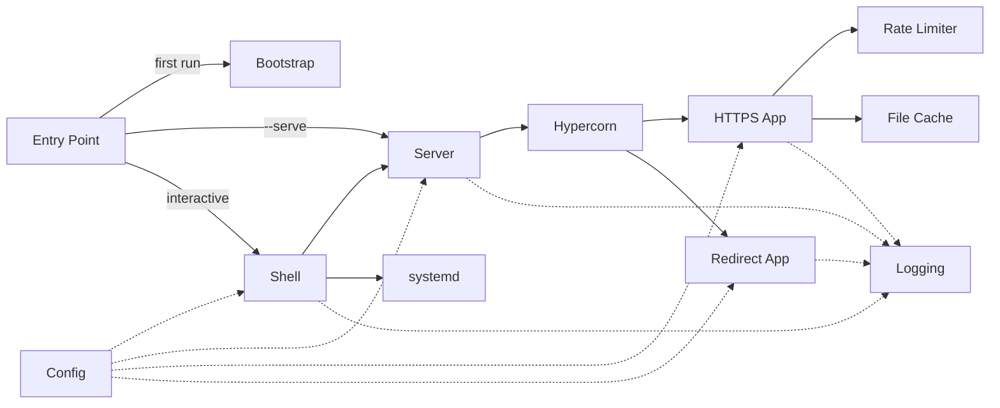

# Architecture

## Design Philosophy

**One file. Managed dependencies. No build step.**

Servette is built around a single constraint: the entire server must live in one Python file. Dependencies are installed automatically into a private virtualenv on first run — the operator never touches pip. A server you can audit in one sitting, copy with `scp`, and run with `python3` is a fundamentally different kind of tool than one that requires a package manager, a build step, or a configuration directory.

Three priorities follow from this:

**Scope discipline.** Servette serves a directory of static files over HTTPS. It does not route dynamic requests, render templates, handle form submissions, or manage sessions. Sharp boundaries keep the codebase small and the remaining features trustworthy.

**Handled, not delegated.** TLS configuration, security headers, certificate renewal, rate limiting, service management — these are real concerns that every public-facing server has to get right. Servette handles them automatically so the operator can focus on their site, not the infrastructure around it.

**Transparent by design.** Everything Servette does is visible in one readable file. There are no layers of abstraction hiding how requests are handled or how security decisions are made.

---

## Architecture Diagram

Servette is a single file, but it is not a monolith. It is organized into discrete modules with well-defined responsibilities. Config and Logging are cross-cutting — nearly every module reads config and writes to the log. The functional flow runs between them.

Solid arrows are control flow. Dashed arrows are dependencies.

---

## Modules

### Bootstrap

On first run, `_bootstrap()` checks whether the process is already running inside the managed virtualenv (`.servette-env/`). If not, it installs the required system package for venv support via `apt-get`, creates the virtualenv, installs dependencies via pip, and re-execs the process inside it using `os.execv`. Subsequent runs skip straight to the re-exec.

Dependencies installed into the virtualenv: `hypercorn`, `cryptography`, `acme`, `josepy`, `aioquic`.

The bootstrap runs before any other code, so the rest of `servette.py` can import from the virtualenv unconditionally.

---

### Config

Config holds all settings in a single object and reads from and writes to `servette.json`. Accessing any setting is `config.serve_dir`, `config.port`, and so on. The config file is kept separate from `servette.py` deliberately — updating the server never overwrites your configuration.

On each incoming request, `reload_if_changed()` checks the file's modification time and reloads if it has changed. This means you can edit `servette.json` directly and have changes take effect without restarting the server.

**Password storage.** Passwords are hashed with PBKDF2-HMAC-SHA256 at 260,000 iterations — the OWASP recommendation at the time of writing. Passwords are never stored in plaintext. A migration path handles older config files that contain a plaintext `password` field: on first load the password is hashed and the plaintext key is removed.

**File permissions.** `servette.json` is written with mode `0o600` (owner read/write only) because it contains the password hash and salt.

---

### Logging

Python's standard `logging` module writes timestamped entries to a rotating log file and the terminal. The log file is capped at 5 MB with 3 backups — important on Pi SD cards where unbounded log growth is a real concern. The behavior differs between the two runtime modes:

- **Interactive shell:** only warnings and errors appear in the terminal. Informational entries go to the log file only, so they don't clutter the shell output.
- **Systemd service (`--serve`):** there is no file handler. Systemd captures stdout and appends it to the configured log file via `StandardOutput=append:`. This avoids two processes writing to the same file simultaneously.

If the log file cannot be opened, the error is silently ignored — logging is not worth crashing the server over.

---

### Rate Limiter

Two independent sliding-window rate limits, both over a 60-second window:

- **Request limit** (`rate_limit`, default 30/min): caps total requests per IP. Stops bots from hammering the server.
- **Auth limit** (`auth_rate_limit`, default 6/min): caps failed authentication attempts per IP. Makes brute-force password guessing impractical.

Both trackers are in-memory dicts of `{ip: [timestamp, ...]}` using `time.monotonic()`. A threading lock protects concurrent access. Stale entries — IPs not seen in over 60 seconds — are pruned on each check to keep memory bounded.

IPv6-mapped IPv4 addresses (`::ffff:x.x.x.x`) are normalized to plain IPv4 so both forms bucket to the same counter. `X-Forwarded-For` is trusted when present, for deployments behind a reverse proxy or Tailscale.

The auth limit only triggers when credentials are actually submitted, not on unauthenticated requests. This prevents locking out a visitor who simply hasn't logged in yet.

---

### File Cache

Files are read once, gzip-compressed, and held in memory in a dict keyed by absolute path. On each request the file's modification time is checked; if it has changed the cache entry is refreshed. Edits to any file in the serve directory take effect immediately without restarting the server.

An ETag is computed as the first 16 hex characters of the SHA-256 hash of the raw file contents. If a browser sends back the same ETag in `If-None-Match`, the server returns 304 Not Modified with no body — the browser uses its cached copy.

Both compressed and raw bytes are stored. If the client sends `Accept-Encoding: gzip` (all modern browsers do), the compressed version is sent. A `Vary: Accept-Encoding` header tells caching proxies to store separate copies for clients that do and don't support gzip.

The cache is protected by a threading lock since Hypercorn may dispatch concurrent requests across threads.

---

### HTTPS App

`https_app` is an ASGI coroutine called by Hypercorn for every incoming HTTPS connection. It handles `GET` and `HEAD` — the only HTTP methods Servette accepts. All other methods return 405 Method Not Allowed.

On each request, in order:

1. Reload config if `servette.json` has changed on disk
2. Check the request rate limit for this IP
3. If auth is configured, check credentials — then check the auth rate limit if credentials were submitted and wrong
4. Resolve the URL path to a file within `serve_dir`, enforcing path traversal protection
5. Return 403 (traversal), 404 (missing file, with optional `404.html` fallback), or 500 (unreadable file) as appropriate
6. Return 304 if the client's ETag matches
7. Send the response with security headers

**Path resolution.** `_resolve_request_path()` decodes percent-encoding, normalizes the path, and verifies the result stays within `serve_dir`. Directories resolve to their `index.html`. Paths that escape `serve_dir` return 403.

**MIME types.** Content-Type is inferred from the file extension. Common web types are supported: HTML, CSS, JS, JSON, images, fonts, PDF, and more. Unknown extensions get `application/octet-stream`.

**Security headers sent on every response:**

| Header | Purpose |
|---|---|
| `Strict-Transport-Security` | Tells browsers to use HTTPS for this domain from now on |
| `X-Frame-Options: DENY` | Prevents the page from being embedded in iframes on other sites |
| `X-Content-Type-Options: nosniff` | Stops browsers from misinterpreting the content type |
| `Referrer-Policy: no-referrer` | Prevents your URL from leaking to sites your page links to |

`Content-Security-Policy` and `Permissions-Policy` are supported but not sent by default. The correct values depend on what your site loads — inline scripts, CDN sources, required browser APIs — so they are left to the operator via `config` → `csp` / `perms`.

---

### Redirect App

`redirect_app` is an ASGI coroutine that listens on port 80 and handles two cases:

**ACME challenge requests.** Let's Encrypt verifies domain ownership by fetching a token file over plain HTTP at `/.well-known/acme-challenge/<token>`. The handler serves these files from `ACME_WEBROOT` on disk. This allows certificate renewal without stopping the server — certbot drops the token file, the running handler serves it, and renewal completes without any downtime.

Token paths are validated: empty tokens and paths containing `/` or `..` are rejected with 404 to prevent directory traversal.

**Everything else.** Plain HTTP requests are redirected to the HTTPS equivalent with 301 Moved Permanently. The port is omitted from the redirect URL when the HTTPS port is 443, keeping the URL clean. Browsers cache 301 redirects, so subsequent visits go straight to HTTPS without touching port 80.

---

### Server

`start_server()` creates a Hypercorn configuration for the HTTPS app and starts it in a background daemon thread with its own asyncio event loop. A second Hypercorn instance for the HTTP redirect runs concurrently via `asyncio.gather`. A `threading.Event` is passed to Hypercorn's `shutdown_trigger` so the shell thread can signal graceful shutdown.

Binding to port 80 requires root. If it fails, the HTTPS server still starts — visitors just need to type `https://` manually. The failure is reported but is not fatal.

On startup, the SSL certificate's expiry date is checked. If it expires within 30 days, a warning is printed with instructions to renew.

`stop_server()` sets the shutdown event and joins the server thread, blocking until Hypercorn exits cleanly.

---

### Shell

The shell is the interactive terminal interface — a command loop that reads input and dispatches to the appropriate function. When Servette is started by systemd (`--serve`), the shell is skipped entirely.

**Config sub-shell.** `config` opens a nested prompt where each setting can be viewed and edited individually. Settings are written to `servette.json` immediately on change. The Shell module is the only place that writes to Config.

**Setup wizard.** `setup` walks through each configuration step in order, checks whether it is already complete, and offers to run it if not. It detects the server's public IP, checks certificate expiry, and offers to install the systemd service. This is the recommended starting point for new users.

**Service management.** `enable` and `disable` write and remove the systemd service file, call `daemon-reload`, and enable/disable the unit. The service file is generated programmatically from the current environment — Python path, `servette.py` path, and log file path are all resolved at enable time, so the service file is always consistent with where Servette actually lives.

---

### Entry Point

`__main__` runs bootstrap first (no-op if already in the virtualenv), then checks for the `--serve` flag:

- **`--serve`**: calls `start_server()` directly and enters a sleep loop. Used exclusively by the systemd service.
- **Interactive**: calls `shell()`. The server starts only when the user runs `start`.

---

## Testing

The test suite (`test.py`) starts a temporary Hypercorn HTTPS server on port 8443, runs checks against it, and tears everything down. `openssl` must be available on the system for test setup. No other configuration required.

Three areas are intentionally not covered by the automated suite:

**Shell and config commands.** The interactive shell can't be driven programmatically without significant scaffolding. Test manually by running `sudo python3 servette.py` and working through `setup`, `config`, `status`, and `log`.

**systemd integration.** Requires a real Linux system with systemd. Test by running `enable`, closing your terminal, and verifying the server is still reachable. Reboot and verify it comes back automatically.

**SSL certificate issuance and renewal.** Requires a domain pointed at a real server. Let's Encrypt verifies domain ownership over the public internet — it cannot be faked in a test environment. Test by running `config` → `cert` with a real domain and checking the expiry date with `status`.

---

## Design Decisions

Things an experienced server operator might question — with the reasoning behind each.

**Running as root.** Servette requires `sudo` because binding to ports 80 and 443 is reserved for root on Linux. The standard alternative — a dedicated system user with `CAP_NET_BIND_SERVICE` — requires creating a system account, configuring file permissions, and managing certificate access across multiple paths. That is several steps that work against Servette's core purpose. For a server with no database, no exec paths, and files served from memory, running as root is a deliberate and reasonable tradeoff.

**Hypercorn over a hand-rolled server.** The original Servette used Python's `BaseHTTPRequestHandler` and `ThreadingMixIn`. Hypercorn replaces this with HTTP/2, modern TLS defaults, and async concurrency — capabilities that would take significant code to implement correctly from scratch. The tradeoff is a dependency, which bootstrap manages invisibly.

**Managed virtualenv over system packages.** Installing Hypercorn and its dependencies system-wide risks conflicts with other Python software on the server. A private virtualenv in `.servette-env/` is isolated, reproducible, and invisible to the rest of the system. The operator never interacts with it directly.

**`threading.Lock` in the rate limiter.** The rate limiter uses a threading lock rather than async primitives because the critical section is microseconds of dict manipulation — not I/O — and doesn't meaningfully block the event loop.

**POST handling and form processing.** POST implies data going somewhere — a database, an email, a file on disk. Servette has no destination for POST data, so it returns 405. If your site submits a form, the backend it posts to is outside Servette's scope.

**WebSockets.** WebSockets require protocol upgrade handling and persistent connection management — out of scope for a static file server.

**Windows and macOS service management.** The `enable` and `disable` commands use systemd, which is Linux-only. Supporting launchd (macOS) and the Windows Service Control Manager would add significant branching complexity for a tool that is, by definition, deployed to a Linux server.

**CSP and Permissions-Policy defaults.** These headers are supported but not sent by default. The correct values depend entirely on what your site loads — inline scripts, external resources, required browser APIs. Hardcoding defaults that would break most sites is worse than sending nothing.
