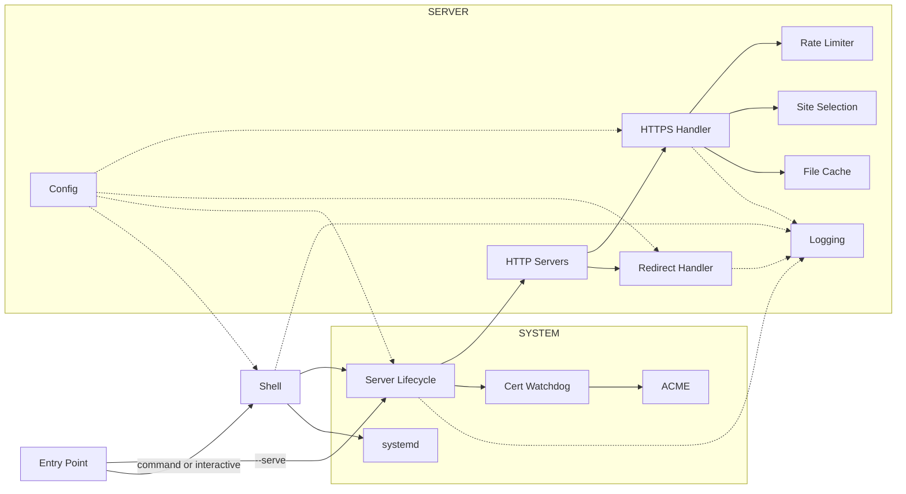

# DESIGN.md

Why Servette is built the way it is, how it is built, and how to operate on it — the developer's document. The user-facing introduction is [`README.md`](README.md); the human–agent working agreement is [`AGENTS.md`](AGENTS.md); closed rulings, their rejected alternatives, and reopen triggers live in [`DECISIONS.md`](DECISIONS.md). This document describes the present: what is true now, not how it got here — where a ruling settled the shape, a pointer marks it.

## Scope & non-goals

Servette is a **production nanoserver**: Python's standard-library `http.server` is a nanoserver — it serves a folder, but stops short of production — and Servette is the production-ready layer over it that makes it fit for the open internet. Its identity is a small set of non-negotiable principles: invariants, not preferences — every design decision serves them, and a change that serves none of them is out of scope by definition. Treat them as the lens for the question "should this exist in Servette?"

| Principle | What it commits us to |
| - | - |
| **Understood by one person** | All of Servette is one literate module — `servette.py`, generated from the five Markdown sources under `src/` — small enough, and structured for reading, that one person can fully understand it: a weekend's honest work, not an afternoon's skim. No module sprawl, no hidden machinery. File count was never the point; what an auditor must understand is. |
| **Secure by default** | Trusted TLS, HTTPS-only (HTTP 301s upward), security headers on every response, optional auth, rate limiting, a least-privilege service user. Security is the default state, never an opt-in. |
| **Production-grade** | Makes the stdlib's `http.server` — a development server, by its own docs — fit to serve real sites on the public internet: automatic certificate renewal, auto-restart, survives reboots. Servette is the production layer, not a dev tool. |
| **Zero-friction operation** | Install the package, run `servette`, follow the wizard. No configuration language, no manual certificate or dependency management. |
| **Minimal footprint** | The standard library — `http.server`, `ssl`, `urllib` — plus a single package, `cryptography`; the transport, TLS, and ACME client are all stdlib or hand-rolled. Nothing installed system-wide; light enough for a Raspberry Pi. |

**Minimalism is the default; the principles above are the only license to add complexity.** General-purpose servers accumulate features — reverse proxying, load balancing, plugins, templating, SPA routing, a live config API. None are needed to satisfy the principles, so each is feature creep: complexity that pulls Servette away from "understood by one person" and "zero-friction" while serving no goal.

The decision rule for any proposed change: **complexity is earned only by serving a non-negotiable principle. Complexity justified solely by capability — "other servers do it" — is rejected.** When principles pull against each other (security features add code, in tension with minimalism), the principle wins over raw line count: HSTS, CSP, ACME, and the rate limiter all cost complexity and all earn it under "secure by default." That is the *only* permitted compromise to minimalism — another principle, never mere feature completeness.

The refusals below are not an exhaustive blocklist; they are the common cases, each an instance of the rule — a feature that serves no principle and is therefore out of scope.

| Out of scope | Why |
| - | - |
| **Dynamic content (`POST` → 405)** | A POST needs a destination — a database, an email, a file. Servette has none. A form's backend lives elsewhere. |
| **SPA deep-link rewriting** | Files are served as-is; `/about` 404s if no such file exists. Client-side routers (React Router, Vue Router) need path→`index.html` rewriting Servette does not do. Use hash routing (`/#/about`) or a platform with rewrite rules. |
| **Reverse proxy, load balancing, live config API** | The bulk of what general-purpose servers carry, serving no principle for a static site. Servette can sit *behind* a single trusted-proxy hop; it does not *become* one. |
| **Plugins, configuration language** | Settings are a handful of defaulted fields in `servette.toml`. Nothing to learn, nothing to extend — by design. |
| **Runtime dependencies beyond `cryptography`** | Stdlib (Python 3.11+) plus the one dependency the package declares. The environment is the package manager's job — Servette manages no venv, runs no installer, and updates no code of its own. |

A request to add any of these is not a feature request; it is a request for a different program. The honest answer is usually to reach for a general-purpose server that does more.

### Platform scope

Linux with systemd is the production target: the service user, ambient-capability port binding, sandboxing, restart-on-death, the network watchdog, and the journal are all systemd facilities, and CI runs the suite on Ubuntu and Debian 12. **macOS runs in session mode**: serving, certificates (self-signed and Let's Encrypt), and the shell all work under plain `servette` — nothing elevates, because the data directory is the operator's own and there is no service to install — while service installation stays Linux-only — the `_IS_MACOS` flag marks every seam, and the suite exercises both sides of each on any host. **Windows is not supported.** The launchd and Windows rulings are in [DECISIONS.md](DECISIONS.md#macos-is-session-mode-windows-is-a-non-goal).

## The request-time invariant

One property underwrites the whole security story and is worth naming on its own, because it — not the file types served — is what makes the guarantees hold: **at request time, Servette never writes to disk and never evaluates user input.** Serving a request is read-and-send, nothing more. Several security properties are not features anyone coded; they are what you get for free by never doing certain things — a read-only served tree, a closed threat model, a systemd sandbox that never has to widen. Every write Servette does perform (config, cert issuance, the ACME challenge file, the published site content) happens in the shell or a background thread, never on the serving path. A proposed change is measured against this invariant first: if it adds a request-time write or evaluates request input, it breaks guarantees the static design gets for free, and it is a different program — not a feature.

The invariant is pinned by the suite rather than argued from the code. Three claims, three checks. **No request reaches a write:** every filesystem primitive is replaced with one that raises, a battery of responses (200, 304, 404, 403, 405, HEAD, gzip) is driven through a live server, and the served tree is compared before and after — the statuses are the evidence, since anything attempting a write would fail its own response. The guards are themselves probed, so the section cannot pass with them inert. **Writes are where the design says they are:** the program's whole write surface is read from the syntax tree and compared against a frozen list, so a new writer anywhere fails until someone says which claim it belongs to; of that list, only the publish pipeline touches a site's content, and setup only ever creates the folder empty. **The wheel is Python only:** the package directory, the absence of any package-data declaration, and — where `python -m build` is available — the built wheel's own contents. That last one is what keeps the inlined error page honest: a page that is not a file cannot be deleted, but only while nothing else creeps in as data.

## The status code tells the truth

A second property worth naming, because it settles a family of choices before they are argued one at a time: **the status code reports what happened; Servette's own contribution goes in the body.** `200` means here is what you asked for. `404` means there is nothing at that address. The number is the half of the answer that machines read — caches, crawlers, uptime monitors — and it is never bent for effect.

The default error page is the case that makes the principle concrete. It carries a full diagnostic page instead of ten bytes of `Not found.`, and it is still a `404`, including at the root of a site with nothing published: the operator's server is working, and there is genuinely no page at that address. Both facts are reported, each in its own channel.

What the principle rules out is a family of tempting moves, all of them the same mistake: a *soft 404* that answers `200` with an apology (the reason search engines end up indexing error pages as content); a `200` at an unpublished root so an uptime check reads green when there is nothing to serve; a `404` standing in for a `403` to make a refusal look like an absence. Each buys a nicer-looking signal by making the signal mean less.

Withholding is not bending. The closed-system miss — a `Host` matching no configured site — deliberately reveals nothing per-site, and does it by keeping the *body* bare while the status stays a true `404`. Version discovery is the same shape: on a site with no password the endpoint is not served at all, so its `404` is a fact about that site, not a disguise. A proposed change is measured against this the way it is measured against the request-time invariant: if it needs the status code to say something other than what happened, the answer is a better body.

## Verification bar

Servette is a security tool, so a claim about it may never sit above its evidence. Three gates stand between a change and `main`, enforced by branch protection:

- **Tests green.** The `Tests` workflow passes on the supported Python versions (CI runs 3.11 and 3.14, plus Debian 12's own 3.11). It is three checks in one gate: `tests/test.py`, `build.py --check` (the module matches `src/`), and `build.py --check-counts` (the line-count figures README states match `src/`). A fourth exists and is green — `build.py --check-docs`, which resolves every path, identifier, flag, command and link the documents name — and the suite runs it, so it gates through `tests/test.py` rather than as a step of its own. A behavior change ships with the test that would have caught its absence; a claim that is a number ships with the run that keeps it true.
- **CodeQL clean.** The code-scanning workflow shows no *new* alerts. Standing alerts are either fixed or dismissed with a recorded reason, so "clean" means clean, not "no new noise."
- **Human read on security surfaces.** Any change touching auth, TLS, rate limiting, or path resolution gets read by a person for what it claims, not only what the tests assert.

A second thing no gate covers: nothing in the suite *executes* the embedded pages. `tests/test.py` pins their text — that a tab exists, that an endpoint is called, that no key ceremony crept in — and `build.py --check` proves the module carries what `src/` holds, but a typo'd identifier or a null dereference during render would pass every gate and reach a browser. Page changes are therefore driven by hand in a real browser and cited as the one-off measurement they are; whether a headless-browser smoke check should join the suite (and bring its dependency with it) is an open decision ([#119](https://github.com/andy-emerson/servette/issues/119)).

What no gate covers is whether a true sentence is the right sentence. `--check-docs` resolves the names a document uses; it cannot tell that a paragraph describes behaviour the code no longer has, because prose that misdescribes working code reads the same to a regex. That failure has happened here — two durable documents once disagreed about whether a 404 at an unpublished root was a cost or a requirement — and the only thing standing against it is the documentation review AGENTS.md requires at merge. Recorded here rather than implied ([#93](https://github.com/andy-emerson/servette/issues/93)).

Prefer understatement: `_production_issues()` is the model — it lists what is wrong rather than implying everything is fine. The failure mode to guard against is never fabrication; it is a claim quietly stronger than its evidence. The stale counts were exactly that failure: a number the page kept asserting long after it stopped being true.

## How it works

Servette is one module (`servette.py` — README states the line count, and a CI gate keeps it true) with three sections, each readable on its own, followed by a short `MAIN` block that instantiates the `Config` singleton and dispatches to `--serve`, a one-shot command, or the shell. Settings persist to `servette.toml` in the data directory. The module is generated from the Markdown sources under `src/` — you edit those, not it (see [Building](#building)).

| Section | Responsibility |
| - | - |
| **Server** | every incoming request: config, rate limiting, file cache, site selection, the request handler and the HTTP servers |
| **System** | the environment: server lifecycle, certificates (incl. the ACME client), systemd, host provisioning, and the runtime the service can reach |
| **Shell** | the interactive terminal interface and the one-shot command form |



### Server

**Config.** A `Config` object reads and writes `servette.toml`; every field has a default. `reload_if_changed()` runs on every incoming request, so edits take effect without a restart. An edit that cannot be safely applied is refused where the value takes effect — fatal at startup (fail closed), last-good-config on the request-path reload — and the two ways a reload can fail are deliberately treated differently. An *invalid* file (unparseable TOML, a `serve_dir` that would serve Servette's own secrets) stays invalid until someone edits it, so its mtime is stamped: one parse and one logged warning per bad edit, not one per request. An *unreadable* file (`_ConfigUnreadable`) is usually a save caught mid-flight — `os.replace` has installed the temp file, `_chown_config()` has not yet restored its ownership — so the reload keeps retrying (warning throttled per mtime) instead of stamping; stamping was a bug that parked a live server on its old config until the next save, because the chown/chmod that restore readability touch only ctime. The change detector's stamp comes from `fstat` of the handle the bytes were read through, never a second stat of the path, so a save landing between read and stat cannot divorce the stamp from the content. Validation happens before any live field mutates — the `unreadable` flag included — so a refused reload can't leave a half-applied config or a shell that stops elevating. Passwords are hashed with scrypt (memory-hard; N=2¹⁴, r=8, p=1) and never stored in plaintext; plaintext `password` fields in old configs are migrated on first load, in memory unconditionally and to disk only where the process can write the data directory — an unprivileged reader defers the file write to the next root command rather than dying at import over a write it was never going to make. Auth is one switch, not two half-states: clearing a site's username deletes its stored hash and salt with it, inside the shared validator, so `set`, the admin page, and the interactive prompt cannot disagree. The file is `servette:<the operator's group>` at `0640` — the service user owns it, the operator reads it, and no other local account does, because a scrypt hash and its salt are material for an offline attack. `save()` writes through a temp file whose mode `os.replace` would install over the live config, so `_chown_config()` restores that ownership after every save; when the operator's group cannot be applied (a `SUDO_USER` deleted since the sudo), it falls back to `servette:servette` — the failure degrades toward the service, which keeps the site up, never toward a `root:root` file that would kill the reload and refuse the next start.

Settings live at exactly one of two levels, with no fallback lookup between them. **Host-level** fields sit on `Config` itself and apply to the whole box — port, rate limits, cache, TLS minimum and ciphers, security headers, ACME email. **Per-site** fields sit on a `Site` object, one per `[[site]]` table in the file: `domain`, `serve_dir`, `cert_file`/`key_file`, `username`/`password_hash`/`password_salt`, and `publish_url`/`publish_key`. A field appearing at both levels would mean a lookup order, and a lookup order is a thing to get wrong; there is exactly one place each value can be.

A config written before `[[site]]` existed is migrated in place on first load: the flat `serve_dir`/`cert_file`/auth/publish keys become a single `[[site]]` table, and because `domain` was never a stored field then — it lived only in the certificate — it is backfilled by reading the existing cert with `_domain_from_cert()`. The migrated file is saved immediately, so the conversion happens once rather than on every load. This is why the `config = Config()` singleton is instantiated at the *end* of the file rather than beside its class: migration calls `_domain_from_cert()`, which is defined much later, in Certificate management.

**Logging.** Interactive mode sends warnings and errors to the terminal; service mode sends output to the systemd journal (`journalctl -u servette`), which handles rotation and retention.

**Rate limiter.** Two independent in-memory sliding-window dicts — total requests (default 120/min) and failed auth attempts (default 6/min) — under a `threading.Lock`, keyed per *bucket* (`_bucket_key`): an IPv4 address is its own bucket, and a native IPv6 address buckets by its /64, because providers hand a subscriber at least a /64 (RFC 6177) and per-address keying let one visitor's 2⁶⁴ addresses each claim a fresh allowance — quietly switching off every limiter for IPv6 clients. The per-IP connection cap shares the same key; log lines keep the full address (`_normalize_ip`), so bucketing costs no forensic fidelity. The auth limiter activates only when credentials are actually submitted, not on unauthenticated requests, and it is consulted *before* the scrypt hash runs — a peek that does not itself count — so a flood of Basic credentials is refused with 429 without paying the memory-hard hash on every attempt. That per-IP gate cannot bound concurrency *across* IPs — many distinct sources each get a first hash before their own limiter engages — so a global `_SCRYPT_SLOTS` semaphore additionally caps concurrent scrypt verifications at 4, holding the transient spike to ~64 MB instead of the ~2 GB that `MAX_CONNECTIONS` alone would permit. Callers past the cap block rather than fail: draining ~40 hashes/s against at most 128 waiters bounds the worst wait at ~3 s, so an attack degrades login to slow, never to unavailable, and auth gains no new response path. Rejected: shedding with 503, which would let an attacker holding the semaphore full deny every legitimate login deterministically. Reopen if `MAX_CONNECTIONS` or the scrypt parameters ever push that worst-case wait past ~10 s — the arithmetic is the assumption. The deliberate cost is that a bucket already over the limit is refused even with correct credentials (the check cannot know they are correct without running the hash it is avoiding), so an attacker flooding failed logins from a shared NAT address — or from anywhere in a shared /64 — can lock out legitimate users of that bucket for the window. `X-Forwarded-For` is trusted only when a `trusted_proxy` IP is configured, and only its rightmost value (one hop). Stale-IP eviction runs in a background `_rate_sweep` thread every 30 seconds, off the request hot path; it starts and stops with the server, not at import.

**File cache.** Files are read once and cached in `_file_cache` keyed by path; compressible (text-like) types are also gzip-stored and the right encoding is sent per `Accept-Encoding`, while already-compressed types (images, fonts, video) are served raw. A file too large to fit the cache is served raw (uncompressed) without being stored, so it can't purge everything else and isn't re-compressed on every request. Each request re-stats the file and compares `(mtime_ns, size, inode)` — this is the live reload. Not mtime alone: tar extraction restores archived mtimes at whole-second granularity, so two pulls could carry the same mtime with different bytes and the cache served the old ones indefinitely; the swap always lands a fresh inode, which the triple catches. ETags (SHA-256 of contents) drive 304 responses. Reading and compressing happen on the connection's own worker thread — each connection gets one — so a large file never starves other connections.

**Site selection (`_select_site`).** Every request is matched to one configured site by its `Host` header, and every response is that site's alone. Matching is uniform regardless of how many sites exist — a one-site box takes the same path as a ten-site box, so there is no separate single-site mode to reason about. An exact (case-insensitive, port-stripped) `domain` match wins; failing that, the first site with no `domain` acts as the catch-all, which is what lets a self-signed or LAN box answer on any hostname. If neither matches, selection returns `None` and the request gets a bare 404 carrying no site-specific information at all — the **closed-system miss**. That 404 is deliberately returned *ahead* of the method check, so a `POST` to an unrecognized host gets the same undifferentiated answer a `GET` would rather than a `405` that would leak "something is here."

Two sites claiming the same domain would make TLS and routing disagree — the SNI table below keys by domain and the last registration wins, while `_select_site` returns the first match, so a visitor would get one site's certificate over another's content. `_domain_in_use()` rejects that when adding a site or changing its domain.

**Request handler (`_handle_request`).** The transport-agnostic core for every HTTPS request: site selection → rate limiting → auth → path resolution → file serving. It takes the method, path, and headers and returns `(status, headers, body)`, so it is a pure function the transport just feeds and sends — no socket, no framework. Site selection runs *ahead* of the limiter, deliberately: selection is a cheap in-memory match, so a flood carrying random `Host` values still pays only that before its 429 — and the reward is that a matched host's 429 carries HSTS like every other response, where the previous order left rate-limited responses as the one un-pinned path a browser could see. An unmatched host's flood is still throttled, with the bare closed-system answer (no site, so no HSTS — the closed system gives it nothing). Authentication is then purely the matched site's own — no fallback to any other level. `_resolve_request_path()` resolves URLs within *that site's* `serve_dir`, enforces path-traversal protection and refuses hidden paths — any segment beginning with `.` except `.well-known` (403), so a `.git` checkout or a stray `.env` left under `serve_dir` is never served — and falls directories back to `index.html`. Serves a custom `404.html` from the same site if present, infers MIME types from extensions, honors single byte ranges (`206` / `416`) for media seeking, and sends security headers on every response: X-Frame-Options, X-Content-Type-Options, Referrer-Policy, Content-Security-Policy, Permissions-Policy, and HSTS when the matched site has a domain configured.

**Redirect handler (`_RedirectHandler`).** The handler on port 80: serves ACME HTTP-01 challenge tokens from `ACME_WEBROOT` during issuance, preserves the query string, and 301-redirects everything else to HTTPS.

**HTTP servers.** `_handle_request` is wrapped by `_Handler` (a stdlib `BaseHTTPRequestHandler`) and run by `_TLSThreadingHTTPServer` — a `ThreadingHTTPServer` that terminates TLS and performs the handshake on the connection's worker thread, not the accept loop, so one slow handshake can't stall new connections. TLS is per-site: `_build_site_ssl_contexts()` builds one `ssl.SSLContext` per configured site (each with the host-level minimum version, optional cipher list, and ALPN pinned to HTTP/1.1) and selects between them with an SNI callback, so each domain is served its own certificate. The context the listening socket is built with is the one presented whenever SNI matches nothing — absent, unrecognized, or direct-IP access. A domainless site's own context serves as that default when one exists; otherwise `_ensure_default_cert()` generates a certificate tied to no site's identity, so an unrecognized connection is answered by something that reveals nothing. This is the TLS half of the closed system, the 404 above being the HTTP half. A `BoundedSemaphore` caps concurrent connections (`MAX_CONNECTIONS`); past the cap connections are closed immediately rather than queued, and a per-connection socket timeout reaps slow or idle ones — together a slowloris / connection-exhaustion mitigation. A second, per-source-IP cap (`MAX_CONNECTIONS_PER_IP`, 32) stops one address from monopolizing the pool: exhausting the 128 slots takes four cooperating sources, not one client. It is enforced at accept time, before any bytes are read — a request-time check would miss connections that never send one — which is also why it is disabled when `trusted_proxy` is set: every connection then carries the proxy's address (the forwarded client is invisible until headers arrive), the cap would throttle the whole site, and connection policing in that topology belongs to the proxy. The honest cost: declaring a `trusted_proxy` that is not actually in front of the box turns the cap off for direct traffic — the declaration is a statement about topology, and the security machinery believes it. Rejected: keying the cap on the forwarded header, which would add attacker-influenced parsing to a security control while missing slowloris entirely. The port-80 redirect uses the same server without TLS. Both run under `serve_forever()` in daemon threads, started by `start_server()`, which fails closed: the bind and the certificate load both happen synchronously as the server is constructed, so a port conflict or unreadable cert raises there and (under `--serve`) exits nonzero rather than leaving a process that looks healthy but serves nothing. `stop_server()` calls `shutdown()` on each server.

### System

**Distribution.** Servette is a pip-installable package ([#77](https://github.com/andy-emerson/Servette/issues/77)): the package manager creates the environment, installs the one dependency, and delivers every upgrade and rollback (`pipx upgrade servette`, `pipx install --force servette==x.y.z`). Servette manages none of that itself — there is no bootstrap, no self-updater, no backup copy. The console script `servette` and `python -m servette` are the same entry (`main()`). The data directory (`BASE_DIR`) is `/var/lib/servette` on Linux (`~/.servette` on macOS session mode), `SERVETTE_HOME` overrides it, which is how the test suite points the program at a throwaway data directory.

**Server lifecycle.** `start_server()` / `stop_server()` own the HTTP servers, their `serve_forever` daemon threads, and the background threads (rate sweep, cert watchdog). Under `--serve`, the main thread then blocks in `_watch_server()`, which polls the HTTPS thread's liveness and returns once it has been dead past a short grace (seconds, and deliberately so: nothing restarts the server in-process under `--serve`, so every dead thread ends in an exit, the grace only sets how long the site stays down first, and every second of it is downtime a certificate rotation pays). `--serve` exits nonzero at that point so systemd's `Restart=always` brings the service back — without the watch, a dead server thread would leave a living process that systemd reports as healthy. A deliberate reload-stop marks itself (`_reload_requested`) so the journal logs it as a restart, not an unexpected death. `_production_issues()` returns the conditions blocking production readiness — serve directory missing, cert not configured, self-signed cert, a username with no stored password (a public site is a choice, not a condition), a small-RAM host with no swap — and is printed on startup and on every `status`. It is the Verification bar's honesty made runtime behavior: it refuses to imply production-ready while anything is wrong.

**Certificates.** Self-signed certs come from the `cryptography` library (`_generate_self_signed_cert`). Let's Encrypt certs use Servette's own minimal ACME client (`_ACMEClient`) — RFC 8555 HTTP-01 over stdlib `urllib` with `cryptography` for the JWS signing and CSR — temporarily starting the redirect handler on port 80 if the main server isn't running. `_obtain_trusted_cert(domain, site)` issues into a specific site. Its retry loop retries exactly one thing — the ACME exchange (up to 3 attempts with backoff; `www.` falling back to the bare domain when only its DNS fails) — and hands the signed material to `_persist_issued_cert`, which runs once: cert and key written through temp files and two `os.replace` calls under `certs/<domain>/` (a kill mid-persistence leaves the old pair or the new pair, not a mismatch that fails `load_cert_chain` at the next start — the residual window is the two renames, honestly not zero), the site pointed at them, the config saved only when that changed anything (a renewal changes nothing), and the server reloaded. Persistence stays outside the retry loop because a local write failure — the sandboxed service cannot write the data directory — is not a CA refusal: retried as one, it burns duplicate certificates against the 5-per-week limit while the renewed cert sits on disk unserved. A save that still fails is logged and does not fail the issuance: the certificate is on disk and about to be served, and the next root command repeats the bookkeeping. Skips the spinner when stdout isn't a TTY (auto-renewal). The client is deliberately narrow — HTTP-01 only, no revocation or key rollover — which is why it fits in one file instead of pulling in the certbot `acme`/`josepy` stack.

**Cert watchdog (`_cert_watchdog`).** A daemon thread polling every 60s, sweeping every configured site each pass: for a site with a domain, renews when its cert expires in < 30 days (at most once per hour on failure, tracked per domain so one site's backoff cannot delay another's renewal); for a domainless site, detects external file changes by mtime and reloads, which is how an externally-managed certificate gets picked up. Each pass runs in `_cert_watchdog_tick()`, and each *site* within a pass is wrapped in its own exception handler — one site's failure can neither skip the rest nor kill the thread (a dead watchdog would silently end renewals for every site). Applying a new cert under `--serve` works by stopping the server and letting `_watch_server` exit non-zero, so systemd relaunches with the new cert — the sandboxed unit user cannot `systemctl restart` itself; the interactive shell (root) restarts the unit directly, and session mode does an in-process stop/start gated by `_wait_for_port_free()`.

**systemd.** `enable`/`disable` write and manage `/etc/systemd/system/servette.service`. `cmd_enable` creates the `servette` system user (no login shell, no home), chowns cert and key to it and the config to it with the operator's group (above), and the unit runs as that user, sandboxed: `AmbientCapabilities=CAP_NET_BIND_SERVICE` lets it bind 80/443 without root, while `NoNewPrivileges`, `ProtectSystem=strict` (with `ReadWritePaths` limited to the server's own directory and the ACME webroot, and `ReadOnlyPaths` pinning the package directory, so a compromised serving process cannot patch the program systemd will restart it into), `PrivateTmp`, and the kernel/cgroup protections confine it. The unit carries `Environment=SERVETTE_HOME` so the service resolves the enabling shell's data directory, and `Environment=PYTHONPATH` only where the package sits outside the interpreter's site-packages — a pip install resolves without it, and an unconditional entry would put a path ahead of the stdlib for nothing. `ExecStart` names the enabling shell's own interpreter (`sys.executable`) — unless the service user cannot reach it, which is the runtime copy below. **Installing as a service is never gated on how the package arrived**: becoming a supervised service that survives reboots is one of Servette's stated principles, so it does not answer to a packaging question ([ruling](DECISIONS.md#pip-install-servette-is-the-only-installation-path)). Paths that systemd directives cannot carry (whitespace) are refused at unit-write time rather than encoded wrongly. Site content is deliberately owned by the *operator* (`SUDO_USER`), with read granted to the `servette` group alone (`g+rX`, never world bits — a `.env` a deploy drags in stays unreadable to other local accounts) — the service only reads it, and `scp` straight into `/var/lib/servette/site/` needs no root.

**Root is requested, not required of the operator.** `run_command` elevates the privileged commands itself, re-running one as `sudo <sys.executable> -m servette <cmd>` and returning to the prompt (`_needs_root`, `_elevate`). `sys.executable` is absolute, so sudo never consults `PATH` — which is why an install needs no symlink onto `secure_path` and the operator never types `sudo` ([ruling](DECISIONS.md#servette-asks-for-root-the-operator-never-types-sudo)). `SERVETTE_HOME` is passed through explicitly, since sudo resets the environment and losing it would point the elevated run at a different data directory. Read-only commands (`status`, `sites`, `log`) stay outside that set so they never prompt. `config.unreadable` is the one exception, making every command elevate: standing in defaults and reporting them as the operator's settings would be a lie, so one password prompt beats a confident wrong answer. The config's group grant (above) is what keeps that exception rare, and the two are one design: a guard that trips during correct operation is a guard people learn to ignore, so the file the operator owns the box for is a file they can read. `start` and `stop` are conditional, elevating only on the systemd path, because a session server lives in the shell's own process where an elevated child could neither outlive its own exit nor reach the parent's. The one-shot `servette <command>` form exits with sudo's status, so tooling sees a refused password as a failure. Freshness is symmetric: an unprivileged shell re-reads the config after its elevated child returns, and a root shell — which never elevates — re-reads it in the dispatcher before every command, so a long-lived root session cannot act on hours-old state and silently revert what tooling wrote in between.

**The runtime the service can reach (`RUNTIME_DIR`).** The shell runs as the operator; the service runs as `servette`, which owns nothing and belongs to no group but its own. A per-user install — `pip install --user`, pipx — sits under a home directory Debian and Ubuntu create mode 0750, which that user cannot traverse, so the unit would name an interpreter and a package it cannot read and the host would restart-loop on `ModuleNotFoundError` after the next boot. `enable` measures instead of assuming (`_reachable_by_service`, `_installed_runtime_reachable`): where the program is out of reach it copies the program and its dependency closure into `/var/lib/servette/runtime`, root-owned and world-readable, and names that copy in the unit — `PYTHONPATH` through the same conditional as a checkout, `ReadOnlyPaths` pinning it inside the writable data directory. The interpreter then comes from `_system_python`, matched on minor version because the copied `cryptography` is built against one ABI; no match refuses the write. The closure is read from installed metadata (`_required_distributions`), not from a list, because a dependency's own dependencies are not this program's to remember; a checkout, having no dist-info, seeds from `_DECLARED_DEPENDENCIES`, which the suite compares against `pyproject.toml`. And because all of that is inference about another user's view of a filesystem, `_verify_runtime` executes the conclusion before anything is committed: the copy is staged (`_build_runtime`), the probe imports the program and the certificate machinery from the staged paths — as the service user via `runuser` or `su` when the caller holds root, unprivileged otherwise, which still proves the imports resolve — and only a passing probe swaps the stage into place (`_commit_runtime`); a failure discards the stage with the known-good runtime and the unit files untouched. Verification precedes the commit because the reverse order installs the refused runtime before the refusal prints — the next restart lands the service on the very thing verification rejected. The writer also refuses unprivileged callers before the stage is built, so a permissions-limited startup refresh can never half-apply ([ruling](DECISIONS.md#the-services-runtime-lives-where-the-service-user-can-read-it)).

Install also provisions two host-level defenses, born of a production post-mortem (a memory spike made `systemd-networkd` drop the default route and never retry; the host stayed dark until a manual reboot while every process on it, Servette included, ran normally). First, a **network watchdog**: `servette-netwatch.service`/`.timer`, a oneshot pair that every minute checks `ip route get` and, if the route is gone, logs that it is acting and `try-restart`s the active network manager — systemd-networkd (Ubuntu), NetworkManager (Raspberry Pi OS), or dhcpcd (older Pi OS); `try-restart` only touches a running unit, so exactly one acts. Every minute because the check is free — `ip route get` consults the local routing table and sends no packets — so the interval buys nothing but recovery time; it was five minutes until the route drill put a number on what that cost. Second, a **swapfile offer**, sized from supply and demand: supply is measured RAM; demand is `Committed_AS` — the kernel's own worst case, what the host would need if every allocation it has handed out were actually used — plus the file-cache ceiling not already inside it, plus a ~700 MB allowance for the single-process spike nobody predicts (sized to the largest observed in production). When demand exceeds RAM, install offers `/swapfile` at twice the deficit, rounded up to two significant digits so the default reads as the estimate it is (floored 512 MB, capped 2 GB, `chmod 600`, persisted via `/etc/fstab`); the prompt accepts Enter for the default, a size in MB to override, or `n` to skip — so the threshold emerges from measurement rather than a hardcoded RAM ceiling, and the operator has the last word.

`Committed_AS` rather than resident usage, for reasons that were measured rather than argued: sampled every two seconds for thirty, resident usage wandered 9 MB while `Committed_AS` held perfectly still — and nine megabytes becomes a 100 MB step once the doubling and the rounding are applied, a noise-driven resize demand no size can satisfy ([ruling](DECISIONS.md#swap-demand-is-measured-as-committed_as-and-the-file-cache-is-charged-once)). It is also the question being asked, and it excludes page cache, which is written back to its own file and never swapped. The honest cost: it counts address space that may never be touched, so a process that reserves generously and writes little makes the estimate high — and since `MemTotal` no longer cancels out of the arithmetic, the same commitment on a larger host correctly asks for less swap. **The file cache is charged exactly once**: a warm cache is file bytes on the Python heap, so it is already inside `Committed_AS` (measured: 200 MB cached raised it by 201 MB), and `_cache_headroom_mb` charges the configured ceiling only where no live process is holding it yet. That ordering is what retired the resize nag — the offer (nothing serving) is always at least the later `status` check (server up, cache in the signal), so a host that accepts the offer is never afterwards told to resize.

Two numbers in that estimate are still guesses, and the design says so rather than implying otherwise: the ×2 margin and the 700 MB spike allowance are one measurement of one runaway process on one host. Published guidance offers nothing better — Red Hat's documentation now calls its own 2×RAM table impractical and defers to workload; Ubuntu's range spans √RAM to 2×RAM — so measuring this host remains the better bet, and these constants are where the measuring stops. Swap also buys time rather than safety: it absorbs the temporary spike that would otherwise take the host offline, but under sustained starvation it prolongs thrashing before the OOM killer rather than preventing it. If Servette's own `/swapfile` already exists but sits below the recommendation, install offers a resize instead: Enter adopts the recommendation, `n` keeps the current size (`[Enter = 1200, any size, n = keep 600]` — no two options redundant), and an active file is `swapoff`'d first with a clean abort if that fails. Sizes come from `/proc/swaps` per device (`_swap_sizes`), never from `SwapTotal`, which lumps every device together — beside a swap partition, the total printed a size the file does not have and could sum past the recommendation, hiding a real undersize. The comparison carries `_SWAP_SLACK_MB` of tolerance, because `mkswap` spends the file's first page on a header: a host that accepted a 1400 MB offer measures 1399 MB active, and compared exactly it would be told to resize to the size it already has, every time, with no size that would satisfy the check. The slack is smaller than the 100 MB step the recommendation's own two-significant-digit rounding moves in, so it cannot hide a difference the recommendation could see. A failed resize rebuilds the previous size — the grow path truncates the old file first, and a memory-tight host that accepted the offer must not end with less swap than it walked in with; when nothing can be rebuilt, the file and its `/etc/fstab` line are removed together, since a line pointing at a missing file is a failed swap unit at every boot. Swap Servette didn't create — a partition, a distro-managed file like Pi OS's `/var/swap` — is never touched; resizing it would fight whatever manages it, and its presence also suppresses the create offer. When the root filesystem is on an SD/eMMC device the prompt notes the flash-wear trade-off, keyed off the storage medium itself (`/dev/mmcblk*`), not the board or distro. Both are host provisioning in the same sense as `useradd` and the unit file — done at install time, as root, once. `disable` removes the watchdog units.

Both defenses have been exercised against the incident they exist for — hand-run drills on a production 512 MB Debian 13 host, 2026-08-20. The spike drill: a 700 MB touched-page balloon (larger than the host's usable RAM, the fwupd shape) ramped over ~30 seconds, held 90 seconds, and released, while the server kept answering throughout; the swapfile absorbed the overflow and `dmesg` recorded no OOM event at all — without swap, that allocation is not survivable on that host. The route drill: `ip route del default` dropped the box off the network, SSH and site dark, no human action taken; the site returned at almost exactly the five-minute mark — the interval the timer fired on then — consistent with the netwatch's next firing restoring the route. The failure that once lasted until a manual reboot now bounds itself at one timer interval (a minute, since the drill motivated shortening it). One caveat the drill itself exposed: the watchdog of that day logged nothing when it acted, so its journal cannot distinguish the restoring run from the no-ops around it — the logger line was added because of this drill, and the next run of the drill should cite the journal line the fix now writes. Hand-run evidence is only as strong as its latest run: re-run both drills after any change to either defense.

**Startup refresh (`_startup_refresh`).** The package manager delivers code but cannot touch systemd units, so every interactive shell launch reconciles instead. `_stale_units()` compares all three unit files on disk against what this version would write; every generated unit opens with a `# generated by servette {version}` stamp, which is load-bearing — a pip upgrade changes no directive, so without the stamp an upgraded host's service would keep running the old code forever. A missing file counts as stale, so a release that *adds* a unit reaches already-enabled hosts. Auto-refresh is gated on the environment matching (`_service_env_drift()`): a stale unit whose `SERVETTE_HOME` or `ExecStart` interpreter differs from this shell's — or that predates the data directory — is reported and left alone, because silently rewriting it would repoint a live service's data or interpreter; that adoption belongs to an explicit `enable`. A pinned interpreter that no longer *exists* (removed by an OS upgrade) is called out as the outage it is — the unit then retries 203/EXEC every few seconds without ever parking in `failed`, so the launch notice saying "the service cannot start until 'enable' re-provisions it" is the only surface that names it. With a matching environment the units are rewritten via `_write_unit_files()` (which writes `_desired_units()` — one computation shared with the checker, so the two cannot drift into a rewrite-every-launch loop) and the service reloaded; without root it prints a hint. The pass touches units only — nothing writes to a site folder except the publish channel, on an operator's explicit `pull`. One-shot commands skip the refresh so `status --json` output stays parseable.

**The public embedded pages (`src/404.html`, `src/connection.html`).** Two pages, each with one job ([ruling](DECISIONS.md#the-connection-test-is-its-own-reserved-page-the-404-is-a-real-404)), authored as real HTML and inlined into the module by `build.py`. The default 404 body is a traditional error page: it leads with the requested path, says the true thing — the server is up and answered, only the path is missing — and links the home page and the connection test. An operator's own `404.html` takes that role by simply existing. The connection test serves at `/.well-known/servette-check` on every site, code-first, so no site content ever shadows the outside vantage: it answers 200 (the page really is there), runs its report in the visitor's browser — the security headers, revalidation, `405` on POST, `403` on traversal, the is-anything-published row that separates a mistyped link from a deploy that never landed, and the auth-gated version row — with every row rendered upfront in a dimmed pending state and resolved in place. Neither page enumerates the filesystem or guesses near-miss filenames, for the same reason the closed-system 404 stays a bare line: a page that did would be a file-discovery oracle. Being part of the module rather than files beside it is deliberate: package data can be deleted on the box, and the pages are code — a running process serves the copies it loaded, an upgrade reaches them on restart, and the checks can never drift from the features they check. The name splits on purpose: the source file and the module's constants are `connection` — singular, because there is only one test — while the URL keeps `servette-check`, because a published address that may be bookmarked or linked from an already-published site is not renamed over a word choice ([ruling](DECISIONS.md#it-is-a-connection-test)) — `_CONNECTION_PATH` carries that note where a reader meets the mismatch.

**The two page roles (code in Server).** The 404 body answers where resolution comes up empty and the site root holds no `404.html` — status 404, because the path really is absent — with validators carried and any positive `max-age` downgraded to revalidate-always, so an error page in a shared cache cannot keep answering 404 after the operator publishes the missing file. The check page carries the same caching contract for its own reason: its checks probe the URL it was served from, and a response without validators would make the page report a defect that is really the response's shape. Both ride the site's own auth — a page that answered past the gate would leak the server's identity to anyone guessing paths on a private site.

This covers a site's own root while nothing is published there — no `index.html` means the root is itself a miss — so **setup and `add-site` write nothing into a site folder.** They create it if missing, say what will answer until the operator publishes, and stop. That is how setup keeps its never-finish-with-nothing-to-serve promise without seeding a file, and it leaves a stronger invariant behind it: the only thing that ever writes to a site folder is the publish channel, on an explicit `pull`. An unpublished root answers `404`, which is what [the status code tells the truth](#the-status-code-tells-the-truth) requires — the site is working and the address is empty, and both are reported in their own channel. The [ruling](DECISIONS.md#the-default-error-page-diagnoses-the-placeholder-is-retired) records the seeded placeholder page it replaces.

**Publish channel (`cmd_pull` / `cmd_restore_site` — code in Shell).** The *pull* content channel, now the advanced path: it publishes with no SSH session at all (delegation, cron-driven deploys), where the admin page over the tunnel is the primary door — both land through the same `_land_bundle`. It is configured per site by two settings: `publish_url` (an `https://` URL for a signed bundle) and `publish_key` (a public Ed25519 key); the signature is what makes an untrusted public shelf safe, and it is this channel's alone — tunnel uploads carry none ([ruling](DECISIONS.md#tunnel-uploads-are-authenticated-by-ssh-the-pull-channel-is-slated-for-removal), which also slates this channel for removal once the tunnel has served a real publish). Each site has its own channel and its own key, so publishing rights to one site grant nothing over another — and the key signs *content only*: Servette's own code arrives through the package manager and holds no in-process signing key to confuse it with. Disabled by default; `_production_issues()` flags a half-configured channel (one setting present, not both). Triggered only by the interactive `pull` command — no network-reachable trigger exists.

`_check_for_content_update()` is the whole pipeline, called by `cmd_pull` and returning a status string it prints: fetch `publish_url` and its `.sig` companion (`_publish_sig_url()` appends `.sig` to the path, not the raw URL, so a query string doesn't break it), verify the signature, extract the tar.gz bundle into a staging directory, and atomically swap it in. The fetch is capped to `_MAX_BUNDLE_BYTES` before the signature check. `_extract_bundle()` is further defense in depth: entries must be plain files or directories, every path is realpath-checked against the destination, the member walk uses `next()` so the uncompressed-size cap can abort a decompression bomb *during* the walk (a `getmembers()` pass would decompress the whole stream before the cap ever ran — only a signed bundle gets this far, so this bounds a compromised publisher, not the open internet), and `filter="data"` (PEP 706) independently enforces the same rules at the library level. `_swap_site_content()` makes the staged tree live with one atomic symlink flip: `serve_dir` is a link into one of two sibling slots (`.a`/`.b`), the staged tree moves into the idle slot, and a single `os.replace` of the link swaps it in — there is no moment in which the live directory does not exist, and a crash leaves old or new content live, never neither. (The retired two-rename design had that moment on every publish, microseconds wide but real, and a crash inside it left no live directory at all behind a log line that only said "rejected".) `serve_dir.bak` marks the single-shot backup — a symlink to the previous tree, or the pre-flip era's real directory, both answering `isdir` alike; a site still holding a real directory converts on its first swap, paying the old rename gap once per site ever. Ownership is repaired on the staged tree *before* it goes live; the backup keeps the ownership it already has, having been the live tree a moment earlier. `cmd_restore_site()` rolls back with the same flip — instant — and consumes the backup.

`_publish_lock` (held from staging through swap — the fetch happens outside it, since downloading mutates nothing) serializes every content mutation across every site: `pull`, a browser upload, and `restore-site` can run from separate sessions against the same `serve_dir` and its slots.

**Version discovery** (`GET /.well-known/servette` — code in Server) reports `{"running": __version__}` as JSON. Its consumer is the embedded error page, which — running on the operator's own origin with the operator's session — is the only page that can read it. Served only when the matched site has auth configured (and the request has passed it), so the exact version reaches only a party holding the credentials, never an anonymous scanner (for whom a precise version is a targeting oracle once a version-specific hole is disclosed — and it is the only version signal Servette emits, since it sends no `Server` header). On a site with no password the path falls through to a normal 404, leaving the endpoint invisible to the public.

### Shell

Two surfaces over one dispatcher (`run_command`): the interactive REPL shown by bare `servette`, and the one-shot `servette <command> [args]` form that runs a single command and exits — the control surface external tooling drives over SSH, which is the authentication (no network admin API exists, by design). Commands: `cmd_setup`, `cmd_config`, `cmd_enable`/`cmd_disable`, `cmd_start`/`cmd_stop`, `cmd_status` (`--json` prints the machine-readable snapshot), `sites` (`--json`), `cmd_set` (`set [n] key=value ...`, validated non-interactively — every pair checked against scratch objects before any is applied; password and domain deliberately excluded), `cmd_log`, `cmd_admin`, `cmd_publish`, `cmd_pull`/`cmd_restore_site`. The `config` sub-shell writes each setting to `servette.toml` immediately; the `publish` sub-shell gathers the content verbs (`pull`, `restore-site`, `channel`) into one guided flow, every verb delegating to the command it gathers.

Commands that act on one site take an optional trailing site index, defaulting to site 0 — the same `[n]` convention as the top-level `log [n]`. That covers `dir`, `cert`, `username`, `password`, and `publish` in the `config` sub-shell, `pull`, `restore-site`, and `channel` in the `publish` sub-shell, and `pull` and `restore-site` at the top level; `_config_site_arg()` resolves the argument once for all of them and prints its own error on a bad index. `sites` lists what is configured, `add-site` walks through folder, domain, and password for a new one — noting, when the folder has no `index.html`, that the error page will answer until the operator publishes one — and `remove-site <n>` deletes a site's server copies along with its config — the published tree, slots, and backup, all derived from the operator's originals; certificate files and folders another site still points at are spared ([ruling](DECISIONS.md#remove-deletes-the-servers-copies-deactivate-is-the-pause)). The keep-everything pause is `set <n> active=no`: a deactivated site keeps config and files but is invisible to `_select_site` on every path, so its Host gets the closed-system miss over a still-valid certificate (or an active catch-all, like any unmatched Host). `move-site <n> <to>` reorders the list — order decides which domainless site answers unmatched Hosts. A box always keeps at least one site, so `remove-site` refuses to remove the last. All three run cores (`_append_site`, `_remove_site`, `_move_site`) shared verbatim with the admin page's site cards.

`cmd_setup` runs three steps: the site folder (created if missing — inside `BASE_DIR` only — and left empty, since an empty folder answers with the error page), the certificate, and the optional password, then offers to enable and start. Setup still cannot finish with nothing to serve; `add-site` makes the same guarantee for every later site.

**The admin page and its loopback server (`cmd_admin`, `_UIHandler`).** The browser half of the paired surfaces ([rulings](DECISIONS.md#one-admin-page-with-tabs-is-the-browser-surface)): one embedded page, `src/admin.html`, served by a `ThreadingHTTPServer` that binds `127.0.0.1` only and lives for exactly one `admin` command's run. The operator reaches it through their own SSH tunnel (a one-time `LocalForward` line beside their `ssh` shortcut, printed by setup and by `admin` itself), so the transport is the same authenticated pipe the shell rides — the "no network admin API" refusal stands untouched, because nothing here is network-reachable. Login is one six-character passcode per run, printed beside the stable link as two labeled lines: the bookmarkable bare URL answers a login page in the tool's own dress ([ruling](DECISIONS.md#the-front-door-is-a-login-link-and-passcode-printed-apart)) whose one field submits the same `t` every request carries; comparison is constant-time, and after five wrong guesses the run stops authenticating anyone — the ceiling that makes a short passcode safe against a local guesser.

Three tabs, split by subject ([ruling](DECISIONS.md#the-page-is-three-tabs-a-site-is-one-card-the-server-is-its-own-page)). **Sites** is one card per site carrying everything about it, so no selector is needed to say which site anything belongs to: the drop strip and Publish, then that site's status, what it serves at, its health rows, its domain, its certificate, and its access switch. The cards are also the site list — add, remove, and move run through `POST /sites`, the same `_append_site` / `_remove_site` / `_move_site` cores the terminal's `add-site` / `remove-site` / `move-site` run, and the page re-renders from fresh `/config` truth after every op. Order is config, because `_select_site` hands unmatched Hosts to the first domainless site. Each card's publish half is the pub tool's bundle builder with the key custody deleted (being on the page *is* the authentication — [ruling](DECISIONS.md#tunnel-uploads-are-authenticated-by-ssh-the-pull-channel-is-slated-for-removal)): drop or pick the folder, hidden paths excluded by the same rule the server serves by, the tar.gz built in the browser, and `POST /upload` with the card's site index landing through `_land_bundle` — the identical staging, extraction guards, atomic swap, backup, and ownership repair as `pull`, capped before the body is read. Naming and certifying are two ops ([ruling](DECISIONS.md#naming-a-site-and-certifying-it-are-two-acts)): `name` writes the domain and cannot fail on DNS; `certificate` runs `_obtain_trusted_cert` and reports that core's own verdict, telling a refusal from a transient failure. **Server** carries the status row with its lifecycle controls (`POST /service` — start, restart, stop; never enable or disable, [ruling](DECISIONS.md#the-page-runs-the-services-lifecycle-never-its-installation)), the version with any newer release PyPI reports (`GET /update`, asked for and cached — [ruling](DECISIONS.md#the-page-reports-an-available-upgrade-installing-stays-in-the-terminal)), the host health rows, and the host settings — including the swapfile size, applied by the same Save through `POST /swap` and `_apply_swapfile` ([ruling](DECISIONS.md#the-swapfile-size-is-a-setting-on-the-page-as-it-always-was-in-the-terminal)). **Statistics** reads `GET /traffic` — the journal re-parsed as counts, named for what happened to each request rather than by status code, charted with a y-axis over a window the reader picks — and the server's load, whose live line differences successive readings of the same cumulative CPU counter the status snapshot carries, so nothing is sampled or stored on the server.

**Content over time (`_swap_site_content`, `_restore_site`, `_stage_preview`).** A site's content is a symlink to a dated sibling tree, `<link>.v<epoch>`, and publishing renames the staged tree to a fresh version and flips the link with one `os.replace` — no window, crash-safe, old or new content live but never neither. The trees behind the live one are the history: the five most recent are kept ([ruling](DECISIONS.md#publishing-keeps-a-ring-of-versions-not-a-single-shot-backup)), the publish time is in the directory name so the ring orders itself without a sidecar file, and two publishes inside one second take a sequence suffix that sorts with the clock. `_restore_site(site, version)` is the core both surfaces run — the terminal's numbered list and each card's Restore button — and it is the publish's own flip, so a rollback has no window either. Nothing is consumed by restoring, which makes restoring the wrong version undoable in its own terms; pruning never touches the live tree, however old, because content being served is not garbage. Two earlier layouts convert on their next publish: the two-slot `.a`/`.b` pair (both idle slots adopted under their own mtimes, the live one a publish later, since renaming a link's target would break it) and a plain real directory. A **preview** stages the same bundle through the same `_extract_bundle` to a sibling the public server never sees, so a bundle a publish would refuse a preview refuses identically; it is served on a token of its own, in the URL path rather than the query — a draft's relative links resolve against the path and drop a query — and framed with `sandbox` withholding `allow-same-origin`, so a script in the operator's own draft has an opaque origin and cannot reach the page that staged it or the passcode that publishes. **Download** hands the live tree back as the tar.gz the publish door accepts, hidden paths excluded on the way out as on the way in.

**Redirects (`_clean_redirects`, in the request path).** An old path goes somewhere new, held per site in config and validated once at load, so serving one is a dict lookup that runs before the filesystem is touched at all ([ruling](DECISIONS.md#redirects-are-a-setting-not-a-file-in-the-site)). That ordering is the design: the `_redirects`-file convention other hosts use puts the table in the site folder, where it is content, and content is read at request time. `/old` and `/old/` are one rule and the query string rides along, because a link pointed at the old path carries its query and dropping it would break it silently. Two validations are load-bearing rather than tidy — a target is narrowed to a site path or an http(s) URL, because `javascript:` in a `Location` runs script on the operator's origin; and control characters are refused on both sides, because a `Location` carrying CR or LF is response splitting. A bad entry is dropped with a log line rather than raised, so one bad line in a hand-edited table cannot take a site down.

Both halves of every setting run the shared cores: `_apply_settings` behind the forms (the validate-on-scratch-then-apply core factored out of `set`, so a value the terminal refuses the page refuses with the same sentence), and one switch for access — clearing a username deletes the stored hash with it, inside that validator. The page reads a `has_password` boolean, never the hash; the masked password travels only in the paired loopback POST and is hashed server-side ([ruling](DECISIONS.md#the-config-tab-sets-the-password-argv-still-never-does)); a password riding with an emptied username is refused before anything applies. Sites are public or private, phrased that way on every surface ([ruling](DECISIONS.md#sites-are-public-or-private-not-password-less-or-protected)); the advanced knobs — serve folder, port, trusted proxy, the pull channel's pair — stay in the terminal ([ruling](DECISIONS.md#the-config-tab-is-a-password-switch-the-advanced-knobs-stay-in-the-terminal)). Every button reads the same way and the page never borrows the browser's voice for a confirmation ([ruling](DECISIONS.md#every-button-reads-the-same-way-and-the-page-never-borrows-the-browsers-voice)). The public internet's vantage is the one view a page on the tunnel cannot compute (cross-origin responses are opaque by the browser's rules), which is why each card's **Test connection** opens that site's own reserved page in a new tab. The terminal narrates a browser publish (`on_publish`), a busy port costs the page and never the flow, and stopping closes the socket — the page cannot outlive the operator's session, and its exit line says to close the browser tab too, since an abandoned tab keeps dialing a port nothing answers on. The embedded pages split by audience: `404.html` and the connection test are the outside view for visitors (public facts only), `admin.html` — with the login page as its front door — is the inside view for the operator ([ruling](DECISIONS.md#the-404-page-is-the-outside-view-the-admin-page-is-the-inside-view)).

**Inside `admin.html`.** The file is authored as real HTML — editable, highlighted, openable in a browser — and both of its long blocks open with a map of what follows, sectioned in the order a reader meets the page: the stylesheet runs theme, frame, wordmark, tabs, cards, badges, buttons, fact rows, prose, forms, site cards, charts, with a button's variants beside the button rather than in whichever section first used them; the script runs shared vocabulary, the server, tabs, and then one section per tab. Three functions are the only way the page talks to its server — `api()` attaches this run's passcode (the string `?t=` appears nowhere else, so no request can be written that forgets it), `getJSON()` reads, and `post(path, body, want)` writes, reading the body before believing the status because a refusal answers with the sentence the terminal would have printed. The one exception says so in place: `/upload` posts the gzipped bundle itself rather than JSON. `reason(e)` decides once what a failure is called — a fetch that dies with no HTTP response at all is a `TypeError`, which on this page means the SSH tunnel, not the server saying no ([#114](https://github.com/andy-emerson/servette/issues/114) was that lesson). Two variables hold everything rendered, `statusData` and `cfgData`, fetched together so no tab can show status from one moment beside config from another. Everything the server sends is escaped before it reaches `innerHTML`; page-authored markup is interpolated as written, and the two helpers say which they are. The drop strip is sized and clickable as the primary action it is rather than as a caption, each card's **Serving** line links the site itself, the Server tab reports free disk where content lands (a health row, because an unread number prevents no outage), and the footer names `servette.org` as the one link that leaves the page ([ruling](DECISIONS.md#the-footer-says-where-more-is-written-down)). The file lands inside a triple-quoted Python literal, so it may contain no triple double-quote and no backslash — the build refuses rather than emit a broken literal.

`add-site` generates a self-signed certificate for the new site *before* asking about a domain, and names it with random bytes rather than the site's list position. Both choices are defensive: a site whose `cert_file` points at a file that was saved to config but never written would make `start_server()`'s pre-flight check refuse to start the whole server — every site — on the next restart; and a position-based name would collide with a surviving site's live certificate after a `remove-site`/`add-site` sequence shifts indices.

### Key constants

| Name | Value | Purpose |
| - | - | - |
| `SERVICE_PATH` | `/etc/systemd/system/servette.service` | systemd unit |
| `NETWATCH_PATH` | `/etc/systemd/system/servette-netwatch` | network watchdog unit pair (`+ .service/.timer`) |
| `ACME_WEBROOT` | `/var/lib/letsencrypt/webroot` | ACME challenge file root |
| `_DEFAULT_CERT_DIR` | `<BASE_DIR>/certs/_default` | certificate for the closed-system TLS fallback, when no site is domainless |
| `_SWAP_PATH` | `/swapfile` | the swapfile install offers to create |
| `RATE_WINDOW` | `60` seconds | sliding window for both rate limits |
| `MAX_CONNECTIONS` | `128` | global cap on concurrent connections |
| `MAX_CONNECTIONS_PER_IP` | `32` | per-source cap on concurrent connections; inert when `trusted_proxy` is set |
| `_SCRYPT_MAX_CONCURRENT` | `4` | concurrent scrypt verifications; excess logins block briefly |
| `_MAX_BUNDLE_BYTES` | `500 MB` | uncompressed size cap for a content bundle, both channels |
| `_UI_PORT` | `8377` | the loopback admin-page server; the operator's `LocalForward` line names it |
| `_CONNECTION_PATH` | `/.well-known/servette-check` | the connection test's reserved path, on every site |
| `_UI_MAX_BAD_CODES` | `5` | wrong pairing-code guesses before a run stops authenticating |

### Notable design decisions

- **Stdlib `http.server`, owned directly** — HTTP/1.1 from the standard library, with Servette supplying the hardening an ASGI server otherwise would: TLS from `ssl.SSLContext`, the handshake off the accept loop, per-connection timeout, connection caps ([ruling](DECISIONS.md#the-transport-is-stdlib-httpserver-owned-directly)).
- **The package manager over self-management** — installing, upgrading, and rolling back Servette are pip's job ([ruling](DECISIONS.md#distribution-is-pippypi--servette-is-not-its-own-package-manager)).
- **CSP default blocks what static sites never need** — plugins (`object-src 'none'`), `eval()`, plain-HTTP external resources — while allowing own-origin, HTTPS externals, inline styles/scripts, and data URIs. Tune via `config > csp`; blank disables it.

## Operating

```bash
servette                          # interactive shell (console script; python -m servette is the same)
servette <command> [args]         # one-shot: run one command and exit (what tooling drives)
python3 -m servette --serve       # non-interactive service mode (used by systemd)
```

The package manager owns the environment: the install brings `cryptography`, and there is nothing to bootstrap. All state lives in the data directory, `BASE_DIR` — `/var/lib/servette` on Linux, `~/.servette` in macOS session mode, `SERVETTE_HOME` to override — never beside the code. Root is requested, never typed: privileged commands elevate themselves and read-only ones never prompt, while the service itself runs as the restricted `servette` user. In a checkout, `SERVETTE_HOME=. python3 -m servette` keeps all of that state inside the checkout.

### Building

`servette.py` is generated and never hand-edited; it is committed to be read, and `build.py --check` holds the committed copy byte-for-byte equal to the sources' build. The source of truth is five literate Markdown files under `src/` — `INIT.md`, `SERVER.md`, `SYSTEM.md`, `SHELL.md`, `MAIN.md` — where the code lives in fenced `python` blocks and the module's own prose lives in Markdown (blockquotes and headings) around it. `src/build.py` concatenates them in that order (`MAIN` last, because the entry point it holds runs on import and calls definitions from every section above), reversing that mapping to assemble the module and adding nothing of its own — every output line comes from a code fence or a blockquote. The package build runs the same transform itself: pip, pipx and `python -m build` enter through `src/_literate_backend.py` (the PEP 517 backend named in `pyproject.toml`), which generates `servette.py` and delegates to setuptools — installing from source IS the literate build, and the test suite generates the module the same way before importing it.

```bash
python3 src/build.py            # generate servette.py from src/ by hand
python3 src/build.py --check    # exit non-zero if the module has drifted from src/
python3 src/build.py --counts        # lines per section, total and code
python3 src/build.py --check-counts  # exit non-zero if the website's counts are stale
```

Edit `src/`, run the build, commit both. Never hand-edit the module: `build.py --check` fails when the two disagree — run it before committing, and CI runs it as a required check — and `build.py` refuses to emit a file that does not parse. The split is byte-preserving, so the generated module is exactly what review and the package build see.

The counts modes exist because the website publishes exact line numbers as the measurable half of "understood by one person" — a headline figure, a per-section table, and three region paragraphs. Those are a measurement claim, so they are only as good as their latest run — left ungated they drift, and have (a hundred-line disagreement went unnoticed until a review). `--check-counts` verifies every line-count figure **this repository** states about itself — the comparison table's readable-source figure and the same figure in "Who is Servette for?" — against the real total, rounded to the hundred the README writes. A reworded sentence fails it too: moving a claim should make someone re-check it, not quietly remove it from the gate's view. CI runs it beside `--check`. The website's exact per-section counts live in another repository and cannot be gated from here, so `--counts` prints them for whoever edits that page.

### The literate style

Each source file is a sequence of cells. A fenced ` ```python ` block holds one def, class, or tight group, and opens with a one-line `# Name` comment — the block's reference name, which the source viewer displays (marker stripped) as the cell header and Navigator entry, and which ships into the module as its minimal section label. One to three sentences of plain prose sit immediately before each fence saying what the code below is; plain prose is the literate view's voice and emits nothing into the module. Markdown `##` headings are the landmarks; there are no banner comments in either view.

Comments inside fences are minimal: docstrings, plus short labels for non-obvious steps. Rationale lives once, in the prose. The one construct that ships prose into the module is the blockquote (`> …`), which `build.py` maps to a `#` comment block — reserved for warnings and invariants that must survive into the generated `servette.py`, and therefore rare. Fences may open and close with blank lines; those are the generated module's inter-block spacing, and the viewer display-trims them while its doc model keeps the exact bytes.

### The website

Servette's website lives in a separate repository, [andy-emerson/websites](https://github.com/andy-emerson/websites), as `servette.org/` — one directory per hostname. It is not in this repository and is not part of the package a user installs.

The separation is the point. While the site sat here as `site/`, a checkout could serve it under `SERVETTE_HOME=.`, which made "clone the program and serve its own folder" the shortest path to deploying servette.org — quietly putting this git repository into the site's deployment story. Servette installs from PyPI; the site is content it serves, like any operator's. Moving the site out removes the shortcut rather than relying on anyone declining to take it ([ruling](DECISIONS.md#the-website-lives-in-its-own-repository)).

What travelled with it: the front page, the source viewer (`servette.org/src/`, a read-only literate view of this repository's `src/*.md`, fetched from GitHub at render time), the publish tool (`servette.org/pub/`), and the viewer's end-to-end harness. What stays here: the program, and its two embedded pages — the error page (`src/404.html`) and the admin page (`src/admin.html`), inlined into the module because every install serves the first and runs the second.

Two things this repository can no longer check, recorded rather than implied. The website publishes exact line counts from `src/`, and `build.py --check-counts` used to gate them; the claim and its source now live in different repositories, so `--counts` prints the numbers and nothing verifies the page carries them. And the viewer harness, which reads both the page and `src/*.md`, now runs from the websites repository with `SERVETTE_SRC` pointing at a checkout of this one.

### Tests

```bash
python3 -m venv .venv && .venv/bin/pip install .   # once — the package brings cryptography
.venv/bin/python3 tests/test.py
```

Requires `openssl` on PATH (used only by test setup to generate a throwaway cert). The suite regenerates `servette.py` from `src/` before importing it — the same transform the package build runs, so what is tested is what ships — then starts a real server on a test port, runs checks, and tears down. It backs up and restores any existing `servette.toml`.

Intentionally not covered end-to-end: live systemd operations and real Let's Encrypt issuance — each needs external infrastructure. Their seams are covered at the unit level: shell dispatch runs under scripted input, the generated unit files are checked (and verified with `systemd-analyze` where available), and `restore-site`, the prompts, and the install helpers have direct tests.

The source viewer's end-to-end harness moved to the websites repository with the page it exercises. It still reads this repository's `src/*.md` — run it there with `SERVETTE_SRC` pointing at a checkout of this one, and it fails loudly rather than passing when that path is missing.

### Git

Remote: `git@github.com:andy-emerson/servette.git`. Open work and decisions live in GitHub issues — todos, bugs, and design forks each as an issue, with closed decision records kept in the closing issue (e.g. [#77](https://github.com/andy-emerson/Servette/issues/77)). Development happens on one short-lived branch per merge, merged via pull request — never directly on `main`, which is protected (no direct pushes, no force-pushes; the test and CodeQL checks must be green before a PR can merge). Reference an issue with `Closes #N` in the PR so it closes on merge, never before its fix lands on `main`. `__version__` never moves during ordinary development — it changes only when cutting a release.

### Releasing (maintainer task)

Servette ships on PyPI as a single-module distribution ([#77](https://github.com/andy-emerson/Servette/issues/77), since narrowed — see DECISIONS); rollback is `pipx install --force servette==x.y.z`. A release is the one and only place `__version__` changes. Versions are date-based, UTC: `0.<yy>.<doy>` — two-digit year and day-of-year (e.g. `0.26.219`).

1. Bump `__version__` in `src/INIT.md`, regenerate `servette.py`, and merge both via their own pull request — the only change that ever touches the version. `pyproject.toml` reads the version from the module; nothing is bumped twice.
2. Tag the merged bump commit with the version and build the artifacts (`python3 -m build`) — or let the publish workflow do both.
3. Publish to PyPI via Trusted Publishing (the GitHub Actions OIDC flow — no long-lived token to leak). The PyPI project name is registered at first publish, deliberately not before ([#77](https://github.com/andy-emerson/Servette/issues/77) ruling 5); the publish workflow is written when that first release is cut.

The publish channel for *site content* is unchanged by any of this: operator bundles keep their own Ed25519 keys, verified in-process by `cmd_pull`.
