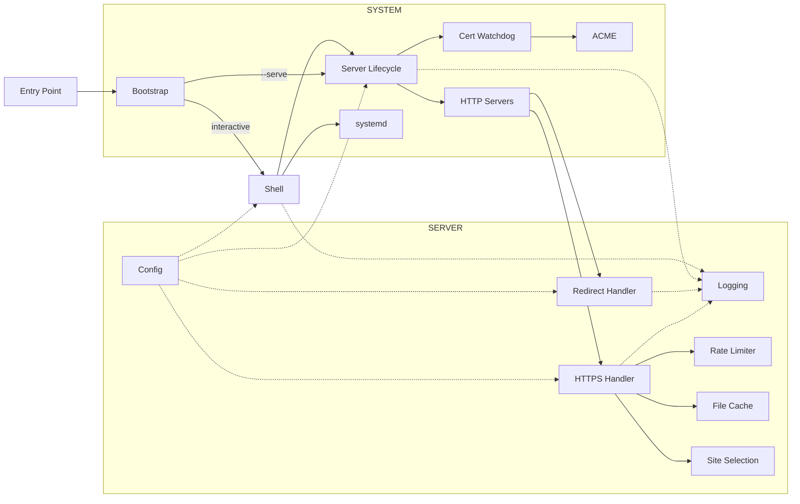

# DESIGN.md

Why Servette is built the way it is, how it is built, and how to operate on it — the developer's document. The user-facing introduction is [`README.md`](README.md); the human–agent working agreement is [`AGENTS.md`](AGENTS.md). This document describes the present: what is true now, not how it got here.

## Scope & non-goals

Servette is a **production nanoserver**: Python's standard-library `http.server` is a nanoserver — it serves a folder, but stops short of production — and Servette is the production-ready layer over it that makes it fit for the open internet. Its identity is a small set of non-negotiable principles: invariants, not preferences — every design decision serves them, and a change that serves none of them is out of scope by definition. Treat them as the lens for the question "should this exist in Servette?"

| Principle | What it commits us to |
| - | - |
| **Single file** | All of Servette is one `servette.py`, readable and debuggable in an afternoon. No module sprawl, no hidden machinery. |
| **Secure by default** | Trusted TLS, HTTPS-only (HTTP 301s upward), security headers on every response, optional auth, rate limiting, a least-privilege service user. Security is the default state, never an opt-in. |
| **Production-grade** | Makes the stdlib's `http.server` — a development server, by its own docs — fit to serve real sites on the public internet: automatic certificate renewal, auto-restart, survives reboots. Servette is the production layer, not a dev tool. |
| **Zero-friction operation** | Copy one file, run it, follow the wizard. No configuration language, no manual certificate or dependency management. |
| **Minimal footprint** | The standard library — `http.server`, `ssl`, `urllib` — plus a single package, `cryptography`; the transport, TLS, and ACME client are all stdlib or hand-rolled. Nothing installed system-wide; light enough for a Raspberry Pi. |

**Minimalism is the default; the principles above are the only license to add complexity.** General-purpose servers accumulate features — reverse proxying, load balancing, plugins, templating, SPA routing, a live config API. None are needed to satisfy the principles, so each is feature creep: complexity that pulls Servette away from "single file" and "zero-friction" while serving no goal.

The decision rule for any proposed change: **complexity is earned only by serving a non-negotiable principle. Complexity justified solely by capability — "other servers do it" — is rejected.** When principles pull against each other (security features add code, in tension with minimalism), the principle wins over raw line count: HSTS, CSP, ACME, and the rate limiter all cost complexity and all earn it under "secure by default." That is the *only* permitted compromise to minimalism — another principle, never mere feature completeness.

The refusals below are not an exhaustive blocklist; they are the common cases, each an instance of the rule — a feature that serves no principle and is therefore out of scope.

| Out of scope | Why |
| - | - |
| **Dynamic content (`POST` → 405)** | A POST needs a destination — a database, an email, a file. Servette has none. A form's backend lives elsewhere. |
| **SPA deep-link rewriting** | Files are served as-is; `/about` 404s if no such file exists. Client-side routers (React Router, Vue Router) need path→`index.html` rewriting Servette does not do. Use hash routing (`/#/about`) or a platform with rewrite rules. |
| **Reverse proxy, load balancing, live config API** | The bulk of what general-purpose servers carry, serving no principle for a static site. Servette can sit *behind* a single trusted-proxy hop; it does not *become* one. |
| **Plugins, configuration language** | Settings are a handful of defaulted fields in `servette.toml`. Nothing to learn, nothing to extend — by design. |
| **Runtime dependencies beyond the managed venv** | Stdlib (Python 3.11+) plus a single package (`cryptography`) Servette installs into `.servette-env/` itself. The operator never runs pip. |

A request to add any of these is not a feature request; it is a request for a different program. The honest answer is usually to reach for a general-purpose server that does more.

## The request-time invariant

One property underwrites the whole security story and is worth naming on its own, because it — not the file types served — is what makes the guarantees hold: **at request time, Servette never writes to disk and never evaluates user input.** Serving a request is read-and-send, nothing more. Several security properties are not features anyone coded; they are what you get for free by never doing certain things — a read-only served tree, a closed threat model, a systemd sandbox that never has to widen. Every write Servette does perform (config, cert issuance, the ACME challenge file, the published site content) happens in the shell or a background thread, never on the serving path. A proposed change is measured against this invariant first: if it adds a request-time write or evaluates request input, it breaks guarantees the static design gets for free, and it is a different program — not a feature.

## Verification bar

Servette is a security tool, so a claim about it may never sit above its evidence. Three gates stand between a change and `main`, enforced by branch protection:

- **Tests green.** `tests/test.py` passes on the supported Python versions (CI runs 3.11 and 3.14). A behavior change ships with the test that would have caught its absence.
- **CodeQL clean.** The code-scanning workflow shows no *new* alerts. Standing alerts are either fixed or dismissed with a recorded reason, so "clean" means clean, not "no new noise."
- **Human read on security surfaces.** Any change touching auth, TLS, rate limiting, or path resolution gets read by a person for what it claims, not only what the tests assert.

Prefer understatement: `_production_issues()` is the model — it lists what is wrong rather than implying everything is fine. The failure mode to guard against is never fabrication; it is a claim quietly stronger than its evidence.

## How it works

Servette is a single file (`servette.py`, ~3,550 lines) with three sections, each readable on its own, followed by a short `MAIN` block that instantiates the `Config` singleton and dispatches to the shell or `--serve`. Settings persist to `servette.toml` beside it. That single file is generated from the Markdown sources under `src/` — you edit those, not it (see [Building](#building)).

| Section | Lines | Responsibility |
| - | - | - |
| **Server** | ~1,010 | every incoming request: config, rate limiting, file cache, site selection, the request handler and the HTTP servers |
| **System** | ~1,120 | the environment: bootstrap, server lifecycle, certificates (incl. the ACME client), systemd and host provisioning |
| **Shell** | ~1,330 | the interactive terminal interface |



### Server

**Config.** A `Config` object reads and writes `servette.toml`; every field has a default. `reload_if_changed()` runs on every incoming request, so edits take effect without a restart. Passwords are hashed with scrypt (memory-hard; N=2¹⁴, r=8, p=1) and never stored in plaintext; plaintext `password` fields in old configs are migrated on first load. The file is written `0o600`.

Settings live at exactly one of two levels, with no fallback lookup between them. **Host-level** fields sit on `Config` itself and apply to the whole box — port, rate limits, cache, TLS minimum and ciphers, security headers, ACME email. **Per-site** fields sit on a `Site` object, one per `[[site]]` table in the file: `domain`, `serve_dir`, `cert_file`/`key_file`, `username`/`password_hash`/`password_salt`, and `publish_url`/`publish_key`. A field appearing at both levels would mean a lookup order, and a lookup order is a thing to get wrong; there is exactly one place each value can be.

A config written before `[[site]]` existed is migrated in place on first load: the flat `serve_dir`/`cert_file`/auth/publish keys become a single `[[site]]` table, and because `domain` was never a stored field then — it lived only in the certificate — it is backfilled by reading the existing cert with `_domain_from_cert()`. The migrated file is saved immediately, so the conversion happens once rather than on every load. This is why the `config = Config()` singleton is instantiated at the *end* of the file rather than beside its class: migration calls `_domain_from_cert()`, which is defined much later, in Certificate management.

**Logging.** Interactive mode sends warnings and errors to the terminal; service mode sends output to the systemd journal (`journalctl -u servette`), which handles rotation and retention.

**Rate limiter.** Two independent in-memory sliding-window dicts per IP — total requests (default 120/min) and failed auth attempts (default 6/min) — under a `threading.Lock`. The auth limiter activates only when credentials are actually submitted, not on unauthenticated requests, and it is consulted *before* the scrypt hash runs — a peek that does not itself count — so a flood of Basic credentials is refused with 429 without paying the memory-hard hash on every attempt. That per-IP gate cannot bound concurrency *across* IPs — many distinct sources each get a first hash before their own limiter engages — so a global `_SCRYPT_SLOTS` semaphore additionally caps concurrent scrypt verifications at 4, holding the transient spike to ~64 MB instead of the ~2 GB that `MAX_CONNECTIONS` alone would permit. Callers past the cap block rather than fail: draining ~40 hashes/s against at most 128 waiters bounds the worst wait at ~3 s, so an attack degrades login to slow, never to unavailable, and auth gains no new response path. Rejected: shedding with 503, which would let an attacker holding the semaphore full deny every legitimate login deterministically. Reopen if `MAX_CONNECTIONS` or the scrypt parameters ever push that worst-case wait past ~10 s — the arithmetic is the assumption. The deliberate cost is that an IP already over the limit is refused even with correct credentials (the check cannot know they are correct without running the hash it is avoiding), so an attacker flooding failed logins from a shared NAT address can lock out legitimate users on that address for the window. IPv6-mapped IPv4 addresses are normalized. `X-Forwarded-For` is trusted only when a `trusted_proxy` IP is configured, and only its rightmost value (one hop). Stale-IP eviction runs in a background `_rate_sweep` thread every 30 seconds, off the request hot path; it starts and stops with the server, not at import.

**File cache.** Files are read once and cached in `_file_cache` keyed by path; compressible (text-like) types are also gzip-stored and the right encoding is sent per `Accept-Encoding`, while already-compressed types (images, fonts, video) are served raw. A file too large to fit the cache is served raw (uncompressed) without being stored, so it can't purge everything else and isn't re-compressed on every request. `mtime` is checked on each request, so the cache refreshes when a file changes — this is the live reload. ETags (SHA-256 of contents) drive 304 responses. Reading and compressing happen on the connection's own worker thread — each connection gets one — so a large file never starves other connections.

**Site selection (`_select_site`).** Every request is matched to one configured site by its `Host` header, and every response is that site's alone. Matching is uniform regardless of how many sites exist — a one-site box takes the same path as a ten-site box, so there is no separate single-site mode to reason about. An exact (case-insensitive, port-stripped) `domain` match wins; failing that, the first site with no `domain` acts as the catch-all, which is what lets a self-signed or LAN box answer on any hostname. If neither matches, selection returns `None` and the request gets a bare 404 carrying no site-specific information at all — the **closed-system miss**. That 404 is deliberately returned *ahead* of the method check, so a `POST` to an unrecognized host gets the same undifferentiated answer a `GET` would rather than a `405` that would leak "something is here."

Two sites claiming the same domain would make TLS and routing disagree — the SNI table below keys by domain and the last registration wins, while `_select_site` returns the first match, so a visitor would get one site's certificate over another's content. `_domain_in_use()` rejects that when adding a site or changing its domain.

**Request handler (`_handle_request`).** The transport-agnostic core for every HTTPS request: rate limiting → site selection → auth → path resolution → file serving. It takes the method, path, and headers and returns `(status, headers, body)`, so it is a pure function the transport just feeds and sends — no socket, no framework. Rate limiting sits *ahead* of site selection, and is host-level: a flood carrying random `Host` values is throttled rather than slipping past the limiter into the closed-system 404. The cost of that ordering is that a rate-limited response never carries HSTS, even for a real site's domain. Authentication is then purely the matched site's own — no fallback to any other level. `_resolve_request_path()` resolves URLs within *that site's* `serve_dir`, enforces path-traversal protection and refuses hidden paths — any segment beginning with `.` except `.well-known` (403), so a `.git` checkout or a stray `.env` left under `serve_dir` is never served — and falls directories back to `index.html`. Serves a custom `404.html` from the same site if present, infers MIME types from extensions, honors single byte ranges (`206` / `416`) for media seeking, and sends security headers on every response: X-Frame-Options, X-Content-Type-Options, Referrer-Policy, Content-Security-Policy, Permissions-Policy, and HSTS when the matched site has a domain configured.

**Redirect handler (`_RedirectHandler`).** The handler on port 80: serves ACME HTTP-01 challenge tokens from `ACME_WEBROOT` during issuance, preserves the query string, and 301-redirects everything else to HTTPS.

**HTTP servers.** `_handle_request` is wrapped by `_Handler` (a stdlib `BaseHTTPRequestHandler`) and run by `_TLSThreadingHTTPServer` — a `ThreadingHTTPServer` that terminates TLS and performs the handshake on the connection's worker thread, not the accept loop, so one slow handshake can't stall new connections. TLS is per-site: `_build_site_ssl_contexts()` builds one `ssl.SSLContext` per configured site (each with the host-level minimum version, optional cipher list, and ALPN pinned to HTTP/1.1) and selects between them with an SNI callback, so each domain is served its own certificate. The context the listening socket is built with is the one presented whenever SNI matches nothing — absent, unrecognized, or direct-IP access. A domainless site's own context serves as that default when one exists; otherwise `_ensure_default_cert()` generates a certificate tied to no site's identity, so an unrecognized connection is answered by something that reveals nothing. This is the TLS half of the closed system, the 404 above being the HTTP half. A `BoundedSemaphore` caps concurrent connections (`MAX_CONNECTIONS`); past the cap connections are closed immediately rather than queued, and a per-connection socket timeout reaps slow or idle ones — together a slowloris / connection-exhaustion mitigation. A second, per-source-IP cap (`MAX_CONNECTIONS_PER_IP`, 32) stops one address from monopolizing the pool: exhausting the 128 slots takes four cooperating sources, not one client. It is enforced at accept time, before any bytes are read — a request-time check would miss connections that never send one — which is also why it is disabled when `trusted_proxy` is set: every connection then carries the proxy's address (the forwarded client is invisible until headers arrive), the cap would throttle the whole site, and connection policing in that topology belongs to the proxy. The honest cost: declaring a `trusted_proxy` that is not actually in front of the box turns the cap off for direct traffic — the declaration is a statement about topology, and the security machinery believes it. Rejected: keying the cap on the forwarded header, which would add attacker-influenced parsing to a security control while missing slowloris entirely. The port-80 redirect uses the same server without TLS. Both run under `serve_forever()` in daemon threads, started by `start_server()`, which fails closed: the bind and the certificate load both happen synchronously as the server is constructed, so a port conflict or unreadable cert raises there and (under `--serve`) exits nonzero rather than leaving a process that looks healthy but serves nothing. `stop_server()` calls `shutdown()` on each server.

### System

**Bootstrap (`_bootstrap`).** Runs before any other code. If `sys.prefix` isn't the managed venv, it creates `.servette-env/`, installs its one dependency (`cryptography`), and `os.execv`s back into itself inside the venv. As a systemd service the venv Python is invoked directly and bootstrap is a no-op.

**Server lifecycle.** `start_server()` / `stop_server()` own the HTTP servers, their `serve_forever` daemon threads, and the background threads (rate sweep, cert watchdog). Under `--serve`, the main thread then blocks in `_watch_server()`, which polls the HTTPS thread's liveness and returns once it has been dead past a grace period (the grace spans an in-process certificate reload's stop/start window); `--serve` exits nonzero at that point so systemd's `Restart=always` brings the service back — without the watch, a dead server thread would leave a living process that systemd reports as healthy. `_production_issues()` returns the conditions blocking production readiness — serve directory missing, cert not configured, self-signed cert, no password, a small-RAM host with no swap — and is printed on startup and on every `status`. It is the Verification bar's honesty made runtime behavior: it refuses to imply production-ready while anything is wrong.

**Certificates.** Self-signed certs come from the `cryptography` library (`_generate_self_signed_cert`). Let's Encrypt certs use Servette's own minimal ACME client (`_ACMEClient`) — RFC 8555 HTTP-01 over stdlib `urllib` with `cryptography` for the JWS signing and CSR — temporarily starting the redirect handler on port 80 if the main server isn't running. `_obtain_trusted_cert(domain, site)` issues into a specific site, writing the certificate under `certs/<domain>/` and recording the path and domain on that site. It first attempts a cert covering both `domain` and `www.domain`; if `www.` fails DNS validation only, it falls back to the bare domain and says so. Retries up to 3 times with backoff; skips the spinner when stdout isn't a TTY (auto-renewal). The client is deliberately narrow — HTTP-01 only, no revocation or key rollover — which is why it fits in one file instead of pulling in the certbot `acme`/`josepy` stack.

**Cert watchdog (`_cert_watchdog`).** A daemon thread polling every 60s, sweeping every configured site each pass: for a site with a domain, renews when its cert expires in < 30 days (at most once per hour on failure, tracked per domain so one site's backoff cannot delay another's renewal); for a domainless site, detects external file changes by mtime and reloads, which is how an externally-managed certificate gets picked up. Each pass runs in `_cert_watchdog_tick()`, and each *site* within a pass is wrapped in its own exception handler — one site's failure can neither skip the rest nor kill the thread (a dead watchdog would silently end renewals for every site). Applying a new cert under `--serve` works by stopping the server and letting `_watch_server` exit non-zero, so systemd relaunches with the new cert — the sandboxed unit user cannot `systemctl restart` itself; the interactive shell (root) restarts the unit directly, and session mode does an in-process stop/start gated by `_wait_for_port_free()`.

**systemd.** `enable`/`disable` write and manage `/etc/systemd/system/servette.service`. `cmd_enable` creates the `servette` system user (no login shell, no home), chowns cert/key/config to it, and the unit runs as that user, sandboxed: `AmbientCapabilities=CAP_NET_BIND_SERVICE` lets it bind 80/443 without root, while `NoNewPrivileges`, `ProtectSystem=strict` (with `ReadWritePaths` limited to the server's own directory and the ACME webroot, and `ReadOnlyPaths` pinning `servette.py`, its `.bak`, and the managed venv read-only within that writable directory — so a compromised serving process cannot rewrite the code it re-execs into), `PrivateTmp`, and the kernel/cgroup protections confine it. `sudo` is needed only for the interactive shell, which writes the unit and calls `useradd`.

Install also provisions two host-level defenses, born of a production post-mortem (a memory spike made `systemd-networkd` drop the default route and never retry; the host stayed dark until a manual reboot while every process on it, Servette included, ran normally). First, a **network watchdog**: `servette-netwatch.service`/`.timer`, a oneshot pair that every 5 minutes checks `ip route get` and, if the route is gone, `try-restart`s the active network manager — systemd-networkd (Ubuntu), NetworkManager (Raspberry Pi OS), or dhcpcd (older Pi OS); `try-restart` only touches a running unit, so exactly one acts. Second, a **swapfile offer**, sized from supply and demand: supply is measured RAM; demand is what's resident now (`MemTotal − MemAvailable`) plus Servette's configured cache plus a ~700 MB allowance for the single-process spike nobody predicts (sized to the largest observed in production). When demand exceeds RAM, install offers `/swapfile` at twice the deficit, rounded up to two significant digits so the default reads as the estimate it is (floored 512 MB, capped 2 GB, `chmod 600`, persisted via `/etc/fstab`); the prompt accepts Enter for the default, a size in MB to override, or `n` to skip — so the threshold emerges from measurement rather than a hardcoded RAM ceiling, and the operator has the last word. If Servette's own `/swapfile` already exists but sits below the recommendation, install offers a resize instead: Enter adopts the recommendation, `n` keeps the current size (`[Enter = 1200, any size, n = keep 600]` — no two options redundant), and an active file is `swapoff`'d first with a clean abort if that fails. Swap Servette didn't create — a partition, a distro-managed file like Pi OS's `/var/swap` — is never touched; resizing it would fight whatever manages it. When the root filesystem is on an SD/eMMC device the prompt notes the flash-wear trade-off, keyed off the storage medium itself (`/dev/mmcblk*`), not the board or distro. Both are host provisioning in the same sense as `useradd` and the unit file — done at install time, as root, once. `disable` removes the watchdog units.

**Self-update (`cmd_update` / `cmd_restore`).** Updates come from signed GitHub Releases, not raw `main`. `cmd_update` fetches the latest release's `servette.py` and `servette.py.sig`, verifies the signature against the pinned `_SIGNING_PUBLIC_KEY`, declines a release older than the running version (`update` only moves forward — `restore` is the deliberate way back), validates syntax, and swaps the file in atomically. Before swapping it copies the current file to `servette.py.bak` — a single-shot backup that `cmd_restore` rolls back to and consumes (one backup is ever kept). The signature is the trust anchor, and it is why distribution goes through releases at all: a release is verifiable, whereas `main` is whatever is currently there, signed by no one. Settings in `servette.toml` are never touched by an update.

Unless a session-mode server is running in this very process (re-executing would kill it silently, so that case prints instructions instead), `cmd_update` then re-execs into the freshly swapped file via `os.execv` with a `--post-update` flag, so the shell is never left running stale code in memory. The fresh process's first action is `_apply_post_update()`: if the service was already enabled, it silently refreshes the unit files via `_write_unit_files()` — the same helper `cmd_enable` calls — and restarts the service, so a release that changes what the unit should contain (this release added the network watchdog timer) reaches an already-enabled host without a separate manual `enable`. `cmd_restore` does not re-exec; it keeps the existing prompt-based `_offer_restart`, since a downgrade changing the unit's shape deserves the operator's attention rather than a silent refresh.

The release-publishing procedure (a maintainer task, since it needs the private key) is in the release procedure below.

**Publish channel (`cmd_pull` / `cmd_restore_site`).** A second, independent update channel — for a site's *content*, not Servette's own code — configured per site by two settings: `publish_url` (an `https://` URL for a signed bundle) and `publish_key` (a public Ed25519 key distinct from `_SIGNING_PUBLIC_KEY`, so a compromised content key can never forge a code update or vice versa). Each site has its own channel and its own key, so publishing rights to one site grant nothing over another. Disabled by default; `_production_issues()` flags a half-configured channel (one setting present, not both). Triggered only by the interactive `pull` command — no network-reachable trigger exists.

`_check_for_content_update()` is the whole pipeline, called by `cmd_pull` and returning a status string it prints: fetch `publish_url` and its `.sig` companion (`_publish_sig_url()` appends `.sig` to the path, not the raw URL, so a query string doesn't break it), verify the signature, extract the tar.gz bundle into a staging directory, and atomically swap it in. The fetch is capped to `_MAX_BUNDLE_BYTES` before the signature check. `_extract_bundle()` is further defense in depth: entries must be plain files or directories, every path is realpath-checked against the destination, and `filter="data"` (PEP 706) independently enforces the same rules at the library level. `_swap_site_content()` mirrors `servette.py.bak`, scoped to the site being pulled: that site's live `serve_dir` is renamed to `serve_dir.bak` before the staged directory is renamed into its place, leaving every other site untouched. `cmd_restore_site()` is `cmd_restore`'s content counterpart.

`_publish_lock` (held for fetch through swap) serializes `pull` and `restore-site` across every site, since both can run from separate shell sessions against the same `serve_dir`/`serve_dir.bak` paths.

**Version discovery** (`GET /.well-known/servette`) reports `{"running": __version__, "backup": <servette.py.bak's version, or null>}` as JSON — what a publish tool needs to show "your server is running vX, backup is vY." Served only when the matched site has a password, so the exact version reaches only a party that already holds it, never an anonymous scanner (for whom a precise version is a targeting oracle once a version-specific hole is disclosed — and it is the only version signal Servette emits, since it sends no `Server` header). On a site with no password the path falls through to a normal 404, leaving the endpoint invisible to the public.

### Shell

The interactive REPL shown when running without `--serve`. Dispatches to `cmd_setup`, `cmd_config`, `cmd_enable`/`cmd_disable`, `cmd_start`/`cmd_stop`, `cmd_status`, `cmd_log`, `cmd_update`/`cmd_restore`, `cmd_pull`/`cmd_restore_site`. The `config` sub-shell writes each setting to `servette.toml` immediately. It contains only UI logic and is the only layer that writes to Config interactively.

Commands that act on one site take an optional trailing site index, defaulting to site 0 — the same `[n]` convention as the top-level `log [n]`. That covers `dir`, `cert`, `username`, `password`, and `publish` in the `config` sub-shell, and `pull` and `restore-site` at the top level; `_config_site_arg()` resolves the argument once for all of them and prints its own error on a bad index. `sites` lists what is configured, `add-site` walks through folder, domain, and password for a new one, and `remove-site <n>` drops a site's configuration while leaving its files on disk. A box always keeps at least one site, so `remove-site` refuses to remove the last.

`add-site` generates a self-signed certificate for the new site *before* asking about a domain, and names it with random bytes rather than the site's list position. Both choices are defensive: a site whose `cert_file` points at a file that was saved to config but never written would make `start_server()`'s pre-flight check refuse to start the whole server — every site — on the next restart; and a position-based name would collide with a surviving site's live certificate after a `remove-site`/`add-site` sequence shifts indices.

### Key constants

| Name | Value | Purpose |
| - | - | - |
| `_VENV_DIR` | `<BASE_DIR>/.servette-env` | managed virtualenv |
| `SERVICE_PATH` | `/etc/systemd/system/servette.service` | systemd unit |
| `NETWATCH_PATH` | `/etc/systemd/system/servette-netwatch` | network watchdog unit pair (`+ .service/.timer`) |
| `ACME_WEBROOT` | `/var/lib/letsencrypt/webroot` | ACME challenge file root |
| `_DEFAULT_CERT_DIR` | `<BASE_DIR>/certs/_default` | certificate for the closed-system TLS fallback, when no site is domainless |
| `_SWAP_PATH` | `/swapfile` | the swapfile install offers to create |
| `RATE_WINDOW` | `60` seconds | sliding window for both rate limits |
| `MAX_CONNECTIONS` | `128` | global cap on concurrent connections |
| `MAX_CONNECTIONS_PER_IP` | `32` | per-source cap on concurrent connections; inert when `trusted_proxy` is set |
| `_SCRYPT_MAX_CONCURRENT` | `4` | concurrent scrypt verifications; excess logins block briefly |
| `_MAX_BUNDLE_BYTES` | `500 MB` | uncompressed size cap for a publish-channel bundle |

### Notable design decisions

- **Stdlib `http.server` over an ASGI server** — a static site needs only HTTP/1.1, which every browser speaks; the threaded model (one capped worker thread per connection) is simple to reason about and removes the largest dependency. Servette owns its transport directly: TLS from `ssl.SSLContext`, the handshake off the accept loop, a per-connection timeout, and a connection cap — the hardening an ASGI server would otherwise supply, kept small enough to read in one file.
- **Managed virtualenv over system packages** — `.servette-env/` is isolated, reproducible, and invisible to the rest of the system.
- **CSP default blocks what static sites never need** — plugins (`object-src 'none'`), `eval()`, plain-HTTP external resources — while allowing own-origin, HTTPS externals, inline styles/scripts, and data URIs. Tune via `config > csp`; blank disables it.

## Operating

```bash
sudo python3 servette.py          # interactive shell (bootstrap re-execs into the venv every time)
python3 servette.py --serve       # non-interactive service mode (used by systemd)
```

First run creates `.servette-env/` (a managed virtualenv), installs `cryptography` into it, then re-execs inside that environment. Subsequent runs skip straight to the re-exec. `sudo` is needed only for the interactive shell (it writes the systemd unit and calls `useradd`); the service itself runs as the restricted `servette` user.

### Building

`servette.py` is generated, not hand-edited. The source of truth is five literate Markdown files under `src/` — `INIT.md`, `SERVER.md`, `SYSTEM.md`, `SHELL.md`, `MAIN.md` — where the code lives in fenced `python` blocks and the module's own prose lives in Markdown (blockquotes and headings) around it. `src/build.py` concatenates them in that order (`MAIN` last, because the entry point it holds runs on import and calls definitions from every section above), reversing that mapping to assemble `servette.py` and adding nothing of its own — every output line comes from a code fence or a blockquote.

```bash
python3 src/build.py            # regenerate servette.py from src/
python3 src/build.py --check    # exit non-zero if servette.py has drifted from src/
```

Edit `src/`, run the build, commit both. Never hand-edit `servette.py`: `build.py --check` fails when the two disagree — run it before committing, and it belongs in CI as a required check — and `build.py` refuses to emit a file that does not parse. The split is byte-preserving, so the generated `servette.py` is reviewed and signed as the release artifact exactly as before.

### Tests

```bash
.servette-env/bin/python3 tests/test.py
```

Requires `openssl` on PATH (used only by test setup to generate a throwaway cert). The suite starts a real server on a test port, runs checks, and tears down. It backs up and restores any existing `servette.toml`.

Intentionally not covered end-to-end: live systemd operations, real Let's Encrypt issuance, and `update`'s network path — each needs external infrastructure. Their seams are covered at the unit level: shell dispatch runs under scripted input, the generated unit files are checked (and verified with `systemd-analyze` where available), and `restore`, the prompts, and the install helpers have direct tests.

### Git

Remote: `git@github.com:andy-emerson/servette.git`. Development happens on one short-lived branch per merge, merged via pull request — never directly on `main`, which is protected (no direct pushes, no force-pushes; the test and CodeQL checks must be green before a PR can merge). Reference an issue with `Closes #N` in the PR so it closes on merge, never before its fix lands on `main`. `__version__` never moves during ordinary development — it changes only when cutting a release.

### Releasing (maintainer task)

Servette updates itself from signed GitHub Releases, not from `main` — the signature is the trust anchor (a release is verifiable; `main` is whatever is currently there, signed by no one). A release is the one and only place `__version__` changes. Publishing requires the private signing key, so it is a maintainer task. Versions are date-based, UTC: `0.<yy>.<doy>` — two-digit year and day-of-year (e.g. `0.26.219`).

1. Bump `__version__` in `servette.py` via its own pull request, and merge it — the only change that ever touches the version.
2. Sign the merged file with the Ed25519 private key (gitignored):
   ```bash
   .servette-env/bin/python3 -c "
   from cryptography.hazmat.primitives.serialization import load_pem_private_key
   sig_key = load_pem_private_key(open('servette_signing.pem','rb').read(), password=None)
   open('servette.py.sig','wb').write(sig_key.sign(open('servette.py','rb').read()))
   print('Signed.')
   "
   ```
3. Create a GitHub release tagged with the version; the tag must point at the merged bump commit.
4. Attach `servette.py` and `servette.py.sig` as release assets.
5. Delete `servette.py.sig` locally — it is per-release, not a permanent artifact.

The pinned public key is `_SIGNING_PUBLIC_KEY` in `servette.py`. The private key (`servette_signing.pem`) and all `*.sig` files are gitignored and must never be committed.
