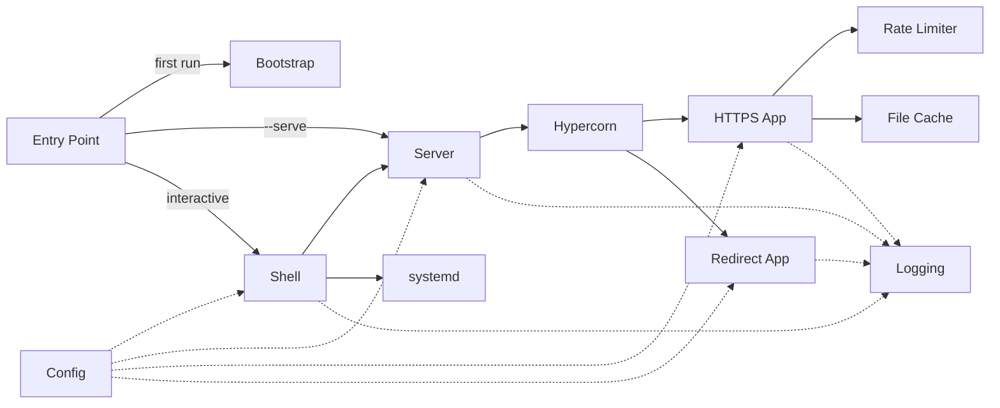

# Ser*vette*
### The Simple Secure Static Site Server

---

Servette is a nanoserver — a single Python file that takes a folder of static files and puts them on the internet, encrypted and protected. Dependencies are installed automatically on first run.

Most servers are built for large, complex applications. They come with databases, routing systems, templating engines, and dozens of configuration files. If all you have is a static site and you just want people to be able to visit it, that is a lot of machinery you do not need.

Servette does one thing well: it takes your static site folder and puts it on the internet, encrypted and protected.

---

## Who is Servette for?

**Static site developers.** If your site is a folder of HTML, CSS, JavaScript, and images — a portfolio, a dashboard, a tool, a game — Servette is built for exactly that use case. Copy your folder, run a few commands, and your site is live with HTTPS and optional password protection.

**Developers who need a quick private deployment.** Built something for your team or a client? Servette puts it on a domain with password protection in minutes, with no infrastructure to maintain.

**People putting their first website online.** You built something. Now you want it live. Existing options are either overwhelming, expensive, or designed for problems much bigger than yours. Servette gets you from a folder on your computer to a real website with a padlock with as little friction as possible.

---

## What Servette provides

| Feature | What it does |
|---|---|
| HTTPS | Your site is encrypted end-to-end; browsers show the padlock |
| HTTP/2 | Faster page loads with multiplexed requests |
| Basic Auth | Optional username and password to restrict access |
| Rate limiting | Stops bots from hammering the server and makes password guessing impractical |
| Live reload | Edit any file and changes appear immediately — no restart required |
| Auto cert renewal | Let's Encrypt certificates renew automatically before they expire |
| HSTS | Tells browsers to always use HTTPS for your domain, even if someone types http:// |
| X-Frame-Options | Prevents your page from being embedded in iframes on other sites |
| X-Content-Type-Options | Stops browsers from misinterpreting your files |
| Referrer-Policy | Your URL is not leaked to third-party sites your page links to |
| Automatic startup | Keeps running after you close your terminal; restarts automatically if the server reboots |

---

## What you'll need

**A Linux server.** Any VPS will work. Common choices include [DigitalOcean](https://digitalocean.com), [Linode](https://linode.com), [Vultr](https://vultr.com), and [AWS Lightsail](https://aws.amazon.com/lightsail/). Ubuntu 22.04 is a reliable starting point. You'll need the server's IP address and SSH access.

**Python 3.8 or higher.** Pre-installed on most Linux servers.

**A folder with your site files.** The directory you want to serve. Servette looks for `index.html` at the root and in any subdirectory. If you don't have a site yet, use the `demo/` folder from this repository to verify everything is working first.

**A domain name (optional).** Only required if you want a free SSL certificate from [Let's Encrypt](https://letsencrypt.org). If you don't have a domain, Servette works with a self-signed certificate — you'll just need to tell your browser to trust it.

On first run, Servette automatically installs its dependencies into a private virtualenv. No manual pip installs required.

---

## Getting started

### 1. Copy your files to the server

From your local machine, copy `servette.py` and your site folder to the server. If your server uses a password to log in:

```
scp servette.py user@your.server.ip:~
scp -r mysite/ user@your.server.ip:~
```

If your server uses a key file:

```
scp -i your-key.pem servette.py user@your.server.ip:~
scp -i your-key.pem -r mysite/ user@your.server.ip:~
```

Replace `user` with your server's username (`pi` on Raspberry Pi, `ubuntu` on Ubuntu, or whatever you set during setup) and `your.server.ip` with its IP address.

### 2. SSH into your server

```
ssh user@your.server.ip
```

Or with a key file:

```
ssh -i your-key.pem user@your.server.ip
```

### 3. Run Servette

```
sudo python3 servette.py
```

`sudo` is required because Servette listens on ports 80 and 443 — the standard ports for HTTP and HTTPS — and Linux reserves those ports for processes running as root. This is a one-time step; once Servette is installed as a service, it starts automatically on reboot without any manual intervention.

On first run, Servette will install its dependencies before dropping you into the shell. This takes a minute.

You will land in the Servette shell.

### 4. Run setup

```
setup
```

The wizard walks you through everything:

1. Choose your site directory
2. Set a password (optional)
3. Set up an SSL certificate
4. Confirm you're ready — Servette enables itself as a service and starts

That's it. Your site is live. Close your terminal and walk away — Servette keeps running and restarts automatically if the server reboots. If you used a domain name, SSL certificates renew automatically.

---

## The Servette shell

Any time you want to check on Servette or change a setting, SSH into your server and run `sudo python3 servette.py` again.

| Command | What it does |
|---|---|
| `setup` | Guided walkthrough for getting started |
| `config` | View and edit your settings |
| `enable` | Enable Servette as a permanent background service |
| `disable` | Remove the background service |
| `start` | Start the server |
| `stop` | Stop the server |
| `status` | Show whether the server is running |
| `log` | Show recent activity |
| `help` | Show the command list |
| `quit` | Exit the shell |

---

## Updating your site

To update your site files, copy the new version to your server:

```
scp -r mysite/ user@your.server.ip:~
```

Changes appear immediately — no restart required.

To update Servette itself, copy the new `servette.py` and restart the service:

```
scp servette.py user@your.server.ip:~
sudo systemctl restart servette
```

Your settings are stored in `servette.json` and are never affected by updates to `servette.py`.

---

## How it works

Servette is a single file, but it is not a monolith. It is organized into discrete modules with well-defined responsibilities.



**Bootstrap** — on first run, installs dependencies (`hypercorn`, `cryptography`, `acme`, `josepy`) into a private virtualenv and re-execs the process inside it. Subsequent runs skip straight to re-exec. The operator never touches pip.

**Config** — reads and writes `servette.json`. Settings take effect without a restart — the file's modification time is checked on every incoming request. Passwords are hashed with PBKDF2-HMAC-SHA256 at 260,000 iterations and never stored in plaintext. `servette.json` is written mode `0o600`.

**Logging** — in interactive mode, warnings and errors go to the terminal. In service mode, output goes to the systemd journal (`journalctl -u servette`), which handles rotation and retention automatically.

**Rate Limiter** — two independent sliding-window limits per IP: total requests (default 30/min) and failed auth attempts (default 6/min). IPv6-mapped IPv4 addresses are normalized. `X-Forwarded-For` is trusted only when a `trusted_proxy` IP is configured.

**File Cache** — files are read once, gzip-compressed, and held in memory keyed by path. Modification time is checked on each request so edits take effect immediately. ETags (SHA-256 of file contents) enable 304 Not Modified responses.

**HTTPS App** — an ASGI coroutine (`https_app`) called by Hypercorn for every HTTPS request. Handles rate limiting → auth → path resolution → file serving. Enforces path traversal protection (403), serves a custom `404.html` if present, infers MIME types from file extensions, and sends security headers on every response (HSTS when a domain cert is active, X-Frame-Options, X-Content-Type-Options, Referrer-Policy).

**Redirect App** — an ASGI coroutine (`redirect_app`) on port 80. Serves Let's Encrypt ACME challenge tokens during certificate issuance; redirects everything else to HTTPS with 301.

**Server** — starts Hypercorn in a background daemon thread with its own asyncio event loop. A `threading.Event` signals graceful shutdown. Checks certificate expiry on startup and warns if it expires within 30 days. A cert watchdog thread polls every 60 seconds: for Let's Encrypt certs it triggers automatic renewal when fewer than 30 days remain (retrying at most once per hour on failure); for any cert it detects external file changes and restarts to pick up the new cert.

**Shell** — the interactive REPL. Dispatches to setup, config, service management, and status commands. The only module that writes to Config.

### Design decisions

**Running as root.** Binding to ports 80 and 443 requires root on Linux. The alternative — a dedicated system user with `CAP_NET_BIND_SERVICE` — requires creating an account, configuring file permissions, and managing certificate access. For a server with no database, no exec paths, and files served from memory, running as root is a deliberate and reasonable tradeoff.

**Hypercorn over a hand-rolled server.** The original Servette used Python's `BaseHTTPRequestHandler`. Hypercorn replaces it with HTTP/2, modern TLS defaults, and async concurrency — capabilities that would take significant code to implement correctly. The tradeoff is a dependency, which bootstrap manages invisibly.

**Managed virtualenv over system packages.** A private virtualenv in `.servette-env/` is isolated, reproducible, and invisible to the rest of the system. The operator never interacts with it directly.

**POST returns 405.** POST implies data going somewhere — a database, an email, a file on disk. Servette has no destination for POST data. If your site submits a form, the backend it posts to is outside Servette's scope.

**CSP and Permissions-Policy not sent.** The correct values depend entirely on what your site loads. Hardcoding defaults that would break most sites is worse than sending nothing.

---

Built with assistance from [Claude](https://claude.ai) (Anthropic).
