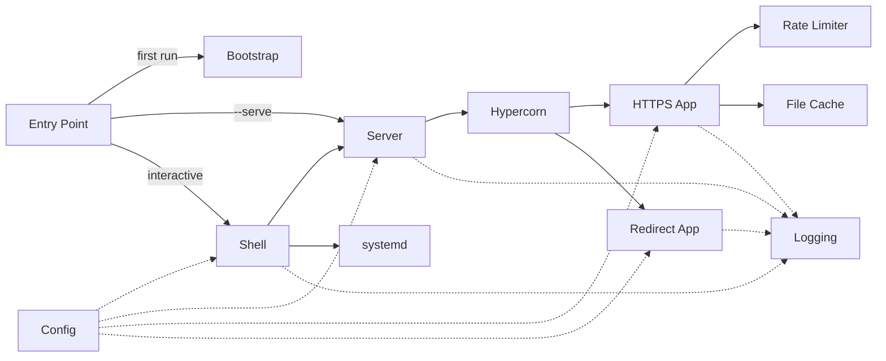

# Ser*vette*
### The Simple Secure Static Site Server

---

Servette is a single Python file that puts a folder of static files on the internet with HTTPS, optional password protection, and auto-renewing certificates. Copy it to a server. Run it. Follow the wizard. Done.

Most ways to host a static site ask you to choose between simplicity and control:

- **Platforms** (GitHub Pages, Netlify, Vercel) are easy but live on someone else's infrastructure, don't support password protection, and disappear if the free tier changes.
- **Real servers** (nginx, Caddy, Apache) give you full control but require learning configuration languages, managing certificates manually, and wiring everything together yourself.

Servette is the middle option: your own server, with the simplicity of a platform.

---

## Who is Servette for?

**People who just want their site live.** You built something — a portfolio, a dashboard, a tool, a game — and you want it on the internet. You don't want to learn nginx. You don't want your site to depend on someone else's platform. You want to copy a file to a server, answer a few questions, and walk away.

**Developers learning how web servers work.** Servette is under 2,000 lines of Python, organized into components with clear boundaries. The full feature set — HTTP/2, TLS, ACME certificate issuance, rate limiting, file caching — is readable in an afternoon. It's a working server, not a toy example.

---

## What Servette provides

| Feature | What it does |
|---|---|
| HTTPS with HTTP/2 | Your site is encrypted; browsers show the padlock; pages load faster with multiplexed requests |
| Basic Auth | Optional username and password to restrict access |
| Rate limiting | Stops bots from hammering the server; makes password guessing impractical |
| Live reload | Edit any file and changes appear immediately — no restart required |
| Auto cert renewal | Let's Encrypt certificates renew automatically before they expire |
| Security headers | HSTS, X-Frame-Options, X-Content-Type-Options, and Referrer-Policy sent on every response |
| Automatic startup | Keeps running after you close your terminal; restarts automatically if the server reboots |

---

## What you'll need

**A Linux server.** Any VPS will work. Common choices include [DigitalOcean](https://digitalocean.com), [Linode](https://linode.com), [Vultr](https://vultr.com), and [AWS Lightsail](https://aws.amazon.com/lightsail/). Ubuntu 22.04 is a reliable starting point. You'll need the server's IP address and SSH access.

**Python 3.8 or higher.** Pre-installed on most Linux servers.

**A folder with your site files.** Servette looks for `index.html` at the root and in any subdirectory. If you don't have a site yet, use the `demo/` folder from this repository to verify everything is working first.

**A domain name (optional).** Only required if you want a free SSL certificate from [Let's Encrypt](https://letsencrypt.org). Without one, Servette generates a self-signed certificate — your browser will warn you, but the connection is still encrypted.

On first run, Servette installs its own dependencies automatically. No manual pip installs required.

---

## Getting started

### 1. Copy your files to the server

From your local machine:

```
scp servette.py user@your.server.ip:~
scp -r mysite/ user@your.server.ip:~
```

Replace `user` with your server's login name (`ubuntu` on Ubuntu, `pi` on Raspberry Pi) and `your.server.ip` with its IP address. If your server uses a key file, add `-i your-key.pem` before the filenames.

### 2. SSH into your server

```
ssh user@your.server.ip
```

### 3. Run Servette

```
sudo python3 servette.py
```

`sudo` is required because setup writes a service file to `/etc/systemd/system/` and creates a system user. The server itself runs as a restricted system user afterward — not as root.

On first run, Servette installs its dependencies before dropping you into the shell. This takes about a minute.

### 4. Run setup

```
setup
```

The wizard walks you through everything:

1. Choose your site directory
2. Set a password (optional)
3. Set up an SSL certificate
4. Confirm you're ready — Servette enables itself as a service and starts

That's it. Your site is live. Close your terminal — Servette keeps running and restarts automatically if the server reboots. If you used a domain name, SSL certificates renew automatically.

---

## The Servette shell

Any time you want to check on Servette or change a setting, SSH into your server and run `sudo python3 servette.py` again.

| Command | What it does |
|---|---|
| `setup` | Guided walkthrough for getting started |
| `config` | View and edit your settings |
| `enable` | Enable Servette as a permanent background service |
| `disable` | Remove the background service |
| `start` | Start the server |
| `stop` | Stop the server |
| `status` | Show whether the server is running |
| `log` | Show recent activity |
| `update` | Download the latest version of Servette |
| `help` | Show the command list |
| `quit` | Exit the shell |

---

## Updating your site

To update your site files, copy the new version to your server:

```
scp -r mysite/ user@your.server.ip:~
```

Changes appear immediately — no restart required.

To update Servette itself, run `update` from the Servette shell. Your settings are stored in `servette.json` and are never affected by updates.

---

## How it works

Servette is a single file, organized into discrete components with clear responsibilities. The sections below map directly to sections of the source code.



**Bootstrap** — on first run, installs dependencies (`hypercorn`, `cryptography`, `acme`, `josepy`) into a private virtualenv and re-execs the process inside it. Subsequent runs skip straight to re-exec. The operator never touches pip.

**Config** — reads and writes `servette.json`. Settings take effect without a restart — the file's modification time is checked on every incoming request. Passwords are hashed with PBKDF2-HMAC-SHA256 at 260,000 iterations and never stored in plaintext. `servette.json` is written mode `0o600`.

**Logging** — in interactive mode, warnings and errors go to the terminal. In service mode, output goes to the systemd journal (`journalctl -u servette`), which handles rotation and retention automatically.

**Rate Limiter** — two independent sliding-window limits per IP: total requests (default 30/min) and failed auth attempts (default 6/min). IPv6-mapped IPv4 addresses are normalized. `X-Forwarded-For` is trusted only when a `trusted_proxy` IP is configured.

**File Cache** — files are read once, gzip-compressed, and held in memory keyed by path. Modification time is checked on each request so edits take effect immediately. ETags (SHA-256 of file contents) enable 304 Not Modified responses.

**HTTPS App** — an ASGI coroutine called by Hypercorn for every HTTPS request. Handles rate limiting → auth → path resolution → file serving. Enforces path traversal protection (403), serves a custom `404.html` if present, infers MIME types from file extensions, and sends security headers on every response (HSTS when a domain cert is active, X-Frame-Options, X-Content-Type-Options, Referrer-Policy).

**Redirect App** — an ASGI coroutine on port 80. Serves Let's Encrypt ACME challenge tokens during certificate issuance; redirects everything else to HTTPS with 301.

**Server** — starts Hypercorn in a background daemon thread with its own asyncio event loop. A `threading.Event` signals graceful shutdown. A cert watchdog thread polls every 60 seconds: for Let's Encrypt certs it triggers automatic renewal when fewer than 30 days remain (retrying at most once per hour on failure); for externally managed certs it detects file changes and restarts to pick up the new cert.

**Shell** — the interactive REPL. Dispatches to setup, config, service management, and status commands. The only component that writes to Config.

### Design decisions

**Dedicated system user.** `enable` creates a `servette` system user with no login shell and no home directory. The service runs as that user with `AmbientCapabilities=CAP_NET_BIND_SERVICE`, which allows binding to ports 80 and 443 without running as root. `sudo` is required to run the interactive shell, which writes the service file and calls `useradd`.

**Hypercorn over a hand-rolled server.** Hypercorn provides HTTP/2, modern TLS defaults, and async concurrency — capabilities that would take significant code to implement correctly. The tradeoff is a dependency, which bootstrap manages invisibly.

**Managed virtualenv over system packages.** A private virtualenv in `.servette-env/` is isolated, reproducible, and invisible to the rest of the system. The operator never interacts with it.

**POST returns 405.** POST implies data going somewhere — a database, an email, a file on disk. Servette has no destination for POST data. If your site submits a form, the backend it posts to is outside Servette's scope.

**CSP and Permissions-Policy not sent.** The correct values depend entirely on what your site loads. Hardcoding defaults that would break most sites is worse than sending nothing.

---

Built with assistance from [Claude](https://claude.ai) (Anthropic).
