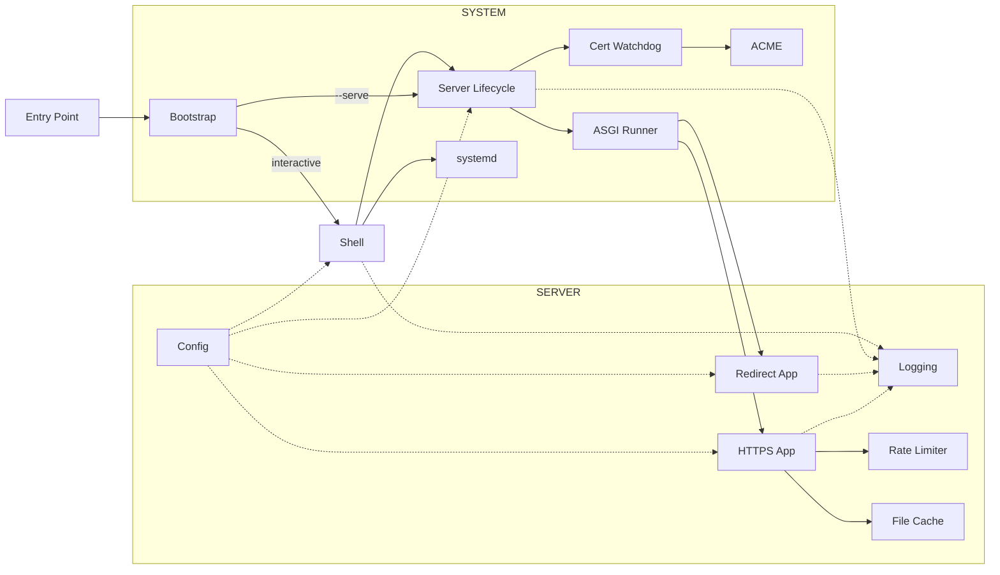

# Servette
### The Simple, Secure Static-Site Server

[](https://github.com/andy-emerson/servette/actions/workflows/test.yml)

---

Servette is a production nanoserver. A nanoserver focuses on doing one thing well, minimizing complexity and file size, which makes them very popular as dev tools. Servette, however, is not a dev tool. It serves a real site on the public internet and, therefore, inherits features that a dev tool may not have: a trusted certificate, automatic renewal, HTTPS enforced at the redirect level, a password if you want one. No configuration language to learn. No certificates to manage. No dependencies to install. Simply copy Servette to a server, run it, follow the wizard, done.

Most ways to host a static site ask you to choose between simplicity and control:

- **Platforms** (GitHub Pages, Netlify, Vercel) are easy but live on someone else's infrastructure, don't support password protection, and disappear if the free tier changes.
- **General-purpose servers** (nginx, Caddy, Apache) give you full control but require learning configuration languages, managing certificates manually, and wiring everything together yourself.

Servette is the middle option: your own server, with the simplicity of a platform. It serves anything that runs in a browser, from a simple portfolio to a serious client-side application. The decrease in complexity is not a decrease in capability — within its domain, nothing is missing.

The closest alternative is Caddy, which handles HTTPS and Let's Encrypt with a famously simple config syntax. But Caddy's core is ~73,000 lines of Go; Servette is under 2,000 lines of Python. For serving a static site, they cover the same ground. Caddy's additional bulk comes from features like reverse proxying, load balancing, and a live config API that a Pi-hosted static site doesn't need. That size difference matters: if something goes wrong, Servette is readily debuggable where Caddy is effectively a black box, and on more constrained hardware like a Raspberry Pi, a smaller footprint has real advantages.

---

## Who is Servette for?

**People who want to own what they ship.** You built something, and you want it on the internet. Not on someone else's platform. Not dependent on a free tier that might disappear. On your own server, with a real certificate, behind a password if you want one. You want to copy a file to a server, answer a few questions, and walk away.

**Raspberry Pi users.** Servette was designed with the Pi in mind. If you can SSH in and run a Python script, you can have a real HTTPS site running on your Pi in under ten minutes, with a trusted certificate, automatic renewal, and a server that survives reboots.

**Developers who want to understand what they're running.** Servette is under 2,000 lines of Python with no hidden magic. It is a working server, not a toy example, and it is readable in an afternoon.

---

## What Servette provides

| Feature | What it does |
|---|---|
| HTTPS with HTTP/2 | Your site is encrypted; browsers show the padlock; pages load faster with multiplexed requests |
| Basic Auth | Optional username and password to restrict access |
| Rate limiting | Stops bots from hammering the server; makes password guessing impractical |
| Live reload | Edit any file and changes appear immediately, no restart required |
| Auto cert renewal | Let's Encrypt certificates renew automatically before they expire |
| Security headers | HSTS, X-Frame-Options, X-Content-Type-Options, Referrer-Policy, Content-Security-Policy, and Permissions-Policy sent on every response |
| Automatic startup | Keeps running after you close your terminal; restarts automatically if the server reboots |

---

## What you'll need

**A Linux server.** A Raspberry Pi works. So does any VPS. Common choices include [DigitalOcean](https://digitalocean.com), [Linode](https://linode.com), [Vultr](https://vultr.com), and [AWS Lightsail](https://aws.amazon.com/lightsail/). Ubuntu 22.04 is a reliable starting point. You'll need the server's IP address and SSH access.

**Python 3.11 or higher.** Pre-installed on most current Linux servers. Raspberry Pi OS Bookworm (the current release) satisfies both the OS and Python requirements on a Raspberry Pi 4.

**A folder with your site files.** Servette looks for `index.html` at the root and in any subdirectory. If you don't have a site yet, use the `demo/` folder from this repository to verify everything is working first.

**A domain name (optional).** Only required if you want a free SSL certificate from [Let's Encrypt](https://letsencrypt.org). Without one, Servette generates a self-signed certificate. Your browser will warn you, but the connection is still encrypted.

Servette depends on a handful of Python packages — Hypercorn, cryptography, and two ACME libraries — but manages them itself. On first run it creates a private virtualenv and installs everything. You will not need to run pip.

---

## Getting started

### 1. Copy your files to the server

From your local machine:

```
scp servette.py user@your.server.ip:~
scp -r mysite/ user@your.server.ip:~/site
```

Replace `user` with your server's login name (`ubuntu` on Ubuntu, `pi` on Raspberry Pi) and `your.server.ip` with its IP address. If your server uses a key file, add `-i your-key.pem` before the filenames.

Servette serves the `site/` folder next to `servette.py`. Copy your files there and it will find them.

### 2. SSH into your server

```
ssh user@your.server.ip
```

### 3. Run Servette

```
sudo python3 servette.py
```

`sudo` is required because setup writes a service file to `/etc/systemd/system/` and creates a system user. The server itself runs as a restricted system user afterward, not as root.

On first run, Servette installs its dependencies before dropping you into the shell. This takes about a minute.

### 4. Run setup

```
setup
```

The wizard walks you through everything:

1. Set a password (optional)
2. Set up an SSL certificate
3. Confirm you're ready. Servette enables itself as a service and starts.

That's it. Your site is live. Close your terminal. Servette keeps running and restarts automatically if the server reboots. If you used a domain name, SSL certificates renew automatically.

---

## The Servette shell

Any time you want to check on Servette or change a setting, SSH into your server and run `sudo python3 servette.py` again.

| Command | What it does |
|---|---|
| `setup` | Guided walkthrough for getting started |
| `config` | View and edit your settings |
| `enable` | Enable Servette as a permanent background service |
| `disable` | Remove the background service |
| `start` | Start the server |
| `stop` | Stop the server |
| `status` | Show whether the server is running |
| `log` | Show recent activity |
| `update` | Download the latest version of Servette |
| `help` | Show the command list |
| `quit` | Exit the shell |

---

## Updating your site

To update your site files, copy the new version to your server:

```
scp -r mysite/ user@your.server.ip:~
```

Changes appear immediately, no restart required.

To update Servette itself, run `update` from the Servette shell. Your settings are stored in `servette.toml` and are never affected by updates.

---

## How it works

Servette is a single file (~2,000 lines) divided into three sections with clear boundaries — Server, System, and Shell — each of which is readable on its own.

| Section | Lines | Responsibility |
|---|---|---|
| **Server** | ~600 | Handles every incoming request: config, rate limiting, file cache, and the two ASGI apps |
| **System** | ~700 | Manages the environment: bootstrap, server lifecycle, certificates, and systemd integration |
| **Shell** | ~650 | The interactive terminal interface |



### Server

**Config:** reads and writes `servette.toml`. Settings take effect without a restart; the file's modification time is checked on every incoming request. Passwords are hashed with PBKDF2-HMAC-SHA256 at 260,000 iterations and never stored in plaintext. `servette.toml` is written mode `0o600`.

**Logging:** in interactive mode, warnings and errors go to the terminal. In service mode, output goes to the systemd journal (`journalctl -u servette`), which handles rotation and retention automatically.

**Rate Limiter:** two independent sliding-window limits per IP: total requests (default 30/min) and failed auth attempts (default 6/min). IPv6-mapped IPv4 addresses are normalized. `X-Forwarded-For` is trusted only when a `trusted_proxy` IP is configured. A background sweep thread evicts stale entries every 30 seconds.

> **Proxy note:** Servette supports a single trusted proxy hop. It reads the rightmost value in `X-Forwarded-For`, which is what that proxy appended — correctly handling both overwrite-style proxies (single value) and append-style proxies like Cloudflare (client IP is the rightmost entry). Multi-hop proxy chains are not supported: if more than one proxy appends to `X-Forwarded-For`, the rightmost value will be an intermediate proxy IP, not the client.

**File Cache:** files are read once, gzip-compressed, and held in memory keyed by path. Modification time is checked on each request so edits take effect immediately. ETags (SHA-256 of file contents) enable 304 Not Modified responses.

**HTTPS App:** an ASGI coroutine called for every HTTPS request. Handles rate limiting, auth, path resolution, and file serving. Enforces path traversal protection (403), serves a custom `404.html` if present, infers MIME types from file extensions, and sends security headers on every response (HSTS when a domain cert is active, X-Frame-Options, X-Content-Type-Options, Referrer-Policy, Content-Security-Policy, Permissions-Policy).

**Redirect App:** an ASGI coroutine on port 80. Serves Let's Encrypt ACME challenge tokens during certificate issuance; redirects everything else to HTTPS with 301.

### System

**Bootstrap:** every invocation from the system Python re-execs the process into the managed virtualenv. On first run (or if the venv is missing), it creates the venv and installs dependencies (`hypercorn`, `cryptography`, `acme`, `josepy`) first. When running as a systemd service, the venv Python is invoked directly and bootstrap is bypassed entirely. The operator never touches pip.

**Server Lifecycle:** starts the ASGI runner (Hypercorn) in a background daemon thread with its own asyncio event loop. A `threading.Event` signals graceful shutdown. Exposes `start_server` and `stop_server` to the shell and the entry point.

**Cert Watchdog:** a daemon thread that polls every 60 seconds. For Let's Encrypt certs, triggers ACME renewal when fewer than 30 days remain (retrying up to 3 times with backoff). For externally managed certs, detects file changes by mtime and restarts to pick up the new cert.

**ACME:** issues and renews Let's Encrypt certificates via the HTTP-01 challenge. Temporarily starts the redirect app on port 80 if the main server isn't running, then tears it down when issuance completes.

**Service Management:** creates a `servette` system user, writes a systemd unit file, and delegates start/stop to `systemctl` when a service is installed.

### Shell

The interactive REPL. Dispatches user commands to Server and System functions. Contains only UI logic — prompts, progress spinners, and formatted output. The only layer that can write to Config interactively.

### Design decisions

**Dedicated system user.** `enable` creates a `servette` system user with no login shell and no home directory. The service runs as that user with `AmbientCapabilities=CAP_NET_BIND_SERVICE`, which allows binding to ports 80 and 443 without running as root. `sudo` is required to run the interactive shell, which writes the service file and calls `useradd`.

**Hypercorn over a hand-rolled server.** Hypercorn provides HTTP/2, modern TLS defaults, and async concurrency. These would take significant code to implement correctly. The tradeoff is a dependency, which bootstrap manages invisibly.

**Managed virtualenv over system packages.** A private virtualenv in `.servette-env/` is isolated, reproducible, and invisible to the rest of the system. The operator never interacts with it.

**POST returns 405.** POST implies data going somewhere: a database, an email, a file on disk. Servette has no destination for POST data. If your site submits a form, the backend it posts to is outside Servette's scope.

**CSP default: block what static sites never need.** A `Content-Security-Policy` header is sent on every response. The default blocks plugins (`object-src 'none'`), `eval()`, and plain HTTP external resources, while allowing own-origin resources, HTTPS externals, inline styles and scripts, and data URIs — things static sites might need. Use `config > csp` to tighten or replace it for your specific site. Set it to blank to disable the header entirely.

**Permissions-Policy default: deny hardware APIs static sites never need.** A `Permissions-Policy` header is sent on every response denying camera, microphone, USB, MIDI, and serial port access — browser APIs that require either a backend or specialized hardware, and that no static site would use by accident. APIs a static site might legitimately use (geolocation, fullscreen, payment) are left at their browser defaults. Use `config > perms` to adjust. Set it to blank to disable the header entirely.

**No SPA deep-link rewriting.** Servette serves files as-is. A request for `/about` looks for a file at that path and returns 404 if it doesn't exist. Single-page applications that rely on client-side routing (React Router, Vue Router, etc.) need a server that rewrites all paths to `index.html` — Servette doesn't do this. If your site is a SPA, either use hash-based routing (`/#/about`) or serve it from a platform that supports rewrite rules.
