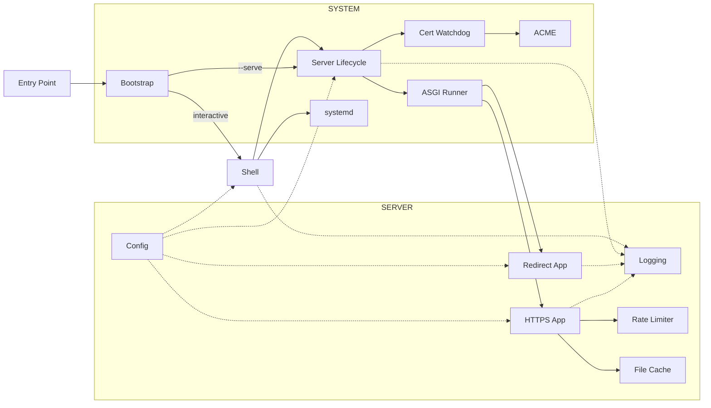

# Design

How Servette works, what it is and isn't, and how we keep it that way. Three questions, one cycle:

| Question | Section | What it covers |
| - | - | - |
| **Where are we going?** | [Scope & non-goals](#scope--non-goals) | what Servette is for, and what it deliberately refuses to become |
| **Where are we?** | [How it works](#how-it-works) · [Status & the claim ladder](#status--the-claim-ladder) | the system as built, and what we honestly claim about it |
| **How do we get there?** | [How we work](#how-we-work) | the process that moves a change from written to pushed without over-claiming or drifting scope |

These are stations on a cycle: scope says what's in bounds, the architecture and status say where things stand, and the methodology moves the next change while keeping the first two true. A document that lags the code is the first step of the next over-claim — so updating this file is a step *inside* the change, not an afterthought.

This is the developer's document. The new-user answer to "what is Servette?" lives in [`README.md`](README.md); agent-facing operating instructions live in [`AGENTS.md`](AGENTS.md); how to contribute lives in [`CONTRIBUTING.md`](CONTRIBUTING.md). Each of those defers here for *why* and *how it works*.

## Scope & non-goals

Servette's identity is a small set of non-negotiable principles. They are invariants, not preferences: every design decision serves them, and a change that serves none of them is out of scope by definition. Treat them as the lens for the question "should this exist in Servette?"

| Principle | What it commits us to |
| - | - |
| **Single file** | All of Servette is one `servette.py`, readable and debuggable in an afternoon. No module sprawl, no hidden machinery. |
| **Secure by default** | Trusted TLS, HTTPS-only (HTTP 301s upward), security headers on every response, optional auth, rate limiting, a least-privilege service user. Security is the default state, never an opt-in. |
| **Production-grade** | Serves real sites on the public internet: automatic certificate renewal, auto-restart, survives reboots. Servette is not a dev tool. |
| **Zero-friction operation** | Copy one file, run it, follow the wizard. No configuration language, no manual certificate or dependency management. |
| **Minimal footprint** | Stdlib plus four packages in a managed virtualenv; nothing installed system-wide; light enough for a Raspberry Pi. |

**Minimalism is the default; the principles above are the only license to add complexity.** General-purpose servers accumulate features — reverse proxying, load balancing, plugins, templating, SPA routing, a live config API. None are needed to satisfy the principles, so each is feature creep: complexity that pulls Servette away from "single file" and "zero-friction" while serving no goal.

The decision rule for any proposed change: **complexity is earned only by serving a non-negotiable principle. Complexity justified solely by capability — "other servers do it" — is rejected.** When principles pull against each other (security features add code, in tension with minimalism), the principle wins over raw line count: HSTS, CSP, ACME, and the rate limiter all cost complexity and all earn it under "secure by default." That is the *only* permitted compromise to minimalism — another principle, never mere feature completeness.

The refusals below are not an exhaustive blocklist; they are the common cases, each an instance of the rule — a feature that serves no principle and is therefore out of scope.

| Out of scope | Why |
| - | - |
| **Dynamic content (`POST` → 405)** | A POST needs a destination — a database, an email, a file. Servette has none. A form's backend lives elsewhere. |
| **SPA deep-link rewriting** | Files are served as-is; `/about` 404s if no such file exists. Client-side routers (React Router, Vue Router) need path→`index.html` rewriting Servette does not do. Use hash routing (`/#/about`) or a platform with rewrite rules. |
| **Reverse proxy, load balancing, live config API** | The bulk of what general-purpose servers carry, serving no principle for a static site. Servette can sit *behind* a single trusted-proxy hop; it does not *become* one. |
| **Plugins, configuration language** | Settings are a handful of defaulted fields in `servette.toml`. Nothing to learn, nothing to extend — by design. |
| **Runtime dependencies beyond the managed venv** | Stdlib (Python 3.11+) plus four packages Servette installs into `.servette-env/` itself. The operator never runs pip. |

A request to add any of these is not a feature request; it is a request for a different program. The honest answer is usually "use Caddy."

## How it works

Servette is a single file (`servette.py`, ~2,000 lines) with three sections, each readable on its own. Settings persist to `servette.toml` beside it.

| Section | Lines | Responsibility |
| - | - | - |
| **Server** | ~550 | every incoming request: config, rate limiting, file cache, the two ASGI apps |
| **System** | ~750 | the environment: bootstrap, server lifecycle, certificates, systemd |
| **Shell** | ~675 | the interactive terminal interface |

### Server

**Config.** A `Config` object reads and writes `servette.toml`; every field has a default. `reload_if_changed()` runs on every incoming request, so edits take effect without a restart. Passwords are hashed with scrypt (memory-hard; N=2¹⁴, r=8, p=1) and never stored in plaintext; plaintext `password` fields in old configs are migrated on first load. The file is written `0o600`.

**Logging.** Interactive mode sends warnings and errors to the terminal; service mode sends output to the systemd journal (`journalctl -u servette`), which handles rotation and retention.

**Rate limiter.** Two independent in-memory sliding-window dicts per IP — total requests (default 120/min) and failed auth attempts (default 6/min) — under a `threading.Lock`. The auth limiter activates only when credentials are actually submitted, not on unauthenticated requests. IPv6-mapped IPv4 addresses are normalized. `X-Forwarded-For` is trusted only when a `trusted_proxy` IP is configured, and only its rightmost value (one hop). Stale-IP eviction runs in a background `_rate_sweep` thread every 30 seconds, off the request hot path; it starts and stops with the server, not at import.

**File cache.** Files are read once and cached in `_file_cache` keyed by path; compressible (text-like) types are also gzip-stored and the right encoding is sent per `Accept-Encoding`, while already-compressed types (images, fonts, video) are served raw. A file too large to fit the cache is served raw (uncompressed) without being stored, so it can't purge everything else and isn't re-compressed on every request. `mtime` is checked on each request, so the cache refreshes when a file changes — this is the live reload. ETags (SHA-256 of contents) drive 304 responses. Reading and compressing happen in a worker thread (via `asyncio.to_thread`), so a large file never blocks the event loop and starves other connections.

**HTTPS app.** The ASGI coroutine for every HTTPS request: rate limiting → auth → path resolution → file serving. `_resolve_request_path()` resolves URLs within `serve_dir`, enforces path-traversal protection (403), and falls directories back to `index.html`. Serves a custom `404.html` if present, infers MIME types from extensions, honors single byte ranges (`206` / `416`) for media seeking, and sends security headers on every response: X-Frame-Options, X-Content-Type-Options, Referrer-Policy, Content-Security-Policy, Permissions-Policy, and HSTS when a domain cert is active.

**Redirect app.** The ASGI coroutine on port 80: serves ACME HTTP-01 challenge tokens from `ACME_WEBROOT` during issuance, and 301-redirects everything else to HTTPS.

Both apps run under Hypercorn in a background daemon thread with its own asyncio event loop, started by `start_server()`. Shutdown is coordinated via a `threading.Event` passed to Hypercorn's `shutdown_trigger`.

### System

**Bootstrap (`_bootstrap`).** Runs before any other code. If `sys.prefix` isn't the managed venv, it creates `.servette-env/`, installs the four dependencies, and `os.execv`s back into itself inside the venv. As a systemd service the venv Python is invoked directly and bootstrap is a no-op.

**Server lifecycle.** `start_server()` / `stop_server()` own the daemon thread, the event loop, and the background threads (rate sweep, cert watchdog). `_production_issues()` returns the conditions blocking production readiness — serve directory missing, cert not configured, self-signed cert, no password — and is printed on startup and on every `status`. This function *is* the claim ladder in code: it refuses to imply production-ready while anything is wrong.

**Certificates.** Self-signed certs come from the `cryptography` library (`_generate_self_signed_cert`). Let's Encrypt certs use `acme`+`josepy` (`_run_acme`) over HTTP-01, temporarily starting `redirect_app` on port 80 if the main server isn't running. `_run_acme` first attempts a cert covering both `domain` and `www.domain`; if `www.` fails DNS validation only, it falls back to the bare domain and says so. Retries up to 3 times with backoff; skips the spinner when stdout isn't a TTY (auto-renewal).

**Cert watchdog (`_cert_watchdog`).** A daemon thread polling every 60s: for a configured domain, renews when the cert expires in < 30 days (at most once per hour on failure); for self-signed certs, detects external file changes by mtime and reloads. `_wait_for_port_free()` gates restarts on the TCP port actually being free.

**systemd.** `enable`/`disable` write and manage `/etc/systemd/system/servette.service`. `cmd_install` creates the `servette` system user (no login shell, no home), chowns cert/key/config to it, and the service runs as that user with `AmbientCapabilities=CAP_NET_BIND_SERVICE` — binding 80/443 without running as root. `sudo` is needed only for the interactive shell, which writes the unit and calls `useradd`.

**Self-update (`cmd_update`).** Updates come from signed GitHub Releases, not raw `main`. `cmd_update` fetches the latest release's `servette.py` and `servette.py.sig`, verifies the signature against the pinned `_SIGNING_PUBLIC_KEY`, validates syntax, and swaps the file in atomically. The signature is the trust anchor, and it is why distribution goes through releases at all: a release is verifiable, whereas `main` is whatever is currently there, signed by no one. Settings in `servette.toml` are never touched by an update. The release-publishing procedure (a maintainer task, since it needs the private key) is in [`AGENTS.md`](AGENTS.md#releasing-maintainer-task).

### Shell

The interactive REPL shown when running without `--serve`. Dispatches to `cmd_setup`, `cmd_config`, `cmd_install`/`cmd_uninstall`, `cmd_start`/`cmd_stop`, `cmd_status`, `cmd_log`, `cmd_update`. The `config` sub-shell writes each setting to `servette.toml` immediately. It contains only UI logic and is the only layer that writes to Config interactively.

### Key constants

| Name | Value | Purpose |
| - | - | - |
| `_VENV_DIR` | `<BASE_DIR>/.servette-env` | managed virtualenv |
| `SERVICE_PATH` | `/etc/systemd/system/servette.service` | systemd unit |
| `ACME_WEBROOT` | `/var/lib/letsencrypt/webroot` | ACME challenge file root |
| `RATE_WINDOW` | `60` seconds | sliding window for both rate limits |

### Notable design decisions

- **Hypercorn over a hand-rolled server** — HTTP/2, modern TLS defaults, and async concurrency that would take significant code to get right. The cost is a dependency, which bootstrap manages invisibly.
- **Managed virtualenv over system packages** — `.servette-env/` is isolated, reproducible, and invisible to the rest of the system.
- **CSP default blocks what static sites never need** — plugins (`object-src 'none'`), `eval()`, plain-HTTP external resources — while allowing own-origin, HTTPS externals, inline styles/scripts, and data URIs. Tune via `config > csp`; blank disables it.
- **Permissions-Policy default denies hardware APIs** — camera, microphone, USB, MIDI, serial — that need a backend or specialized hardware. APIs a static site might use (geolocation, fullscreen, payment) are left at browser defaults. Tune via `config > perms`; blank disables it.

## Status & the claim ladder

Servette is complete within its scope; "where are we?" is mostly "here is the finished shape, and here is what we claim about it." The standing claim is in the tagline — *secure* — and a claim may never sit above its evidence.

| Rung | Meaning | Evidence |
| - | - | - |
| **Stated** | asserted; no evidence yet | — |
| **Tested** | passes our own suite | `tests/test.py` green, server exercised on a real port |
| **Scanned** | clears automated static analysis | CodeQL workflow passing, no open alerts |
| **Reviewed** | a human has read the change for what it claims | code review / security review |

"Secure" is a Reviewed-rung claim and stays honest only while the rungs below it hold: the test suite passes, CodeQL is clean, and security-relevant changes get read. Prefer understatement — `_production_issues()` is the model: it lists what's wrong rather than implying everything's fine. The failure mode to guard against is never fabrication; it's a claim quietly one rung above its evidence ("tests pass" drifting into "secure").

## How we work

Servette is built in human–agent collaboration, and says so. The human holds design authority and is the author of record; the agent writes code and surfaces trade-offs. This works because openness is paired with verification and responsibility — credit is *earned by the rigor*, not granted by a trailer. Energy spent hiding how a security tool is built is the wrong kind of energy; it belongs in the evidence instead. (Mechanics of attribution live in [`AGENTS.md`](AGENTS.md); the contributor's view in [`CONTRIBUTING.md`](CONTRIBUTING.md).)

The methodology is scaled to the project. A 2,000-line finished server does not need a dependency frontier or a reference oracle; reproducing that machinery would itself be the scope creep this document exists to prevent. What ports is the principle, not the apparatus.

### The change loop

1. **Pick a scoped change.** One thing. If it argues for a non-goal above, stop — that's a different program.
2. **Make it with a test that can fail.** A bug fix ships in the same commit as the test that would have caught it. (A few areas are intentionally uncovered — see [`AGENTS.md`](AGENTS.md#tests).)
3. **Run the bar.** `tests/test.py` green; CodeQL clean for security-relevant work; for anything touching auth, TLS, rate limiting, or path resolution, a human read.
4. **Update the docs in the same change.** README for user-facing surface, this file for architecture or scope, AGENTS.md for operating detail. Docs that lag the code are the first step of the next over-claim. Before merging, reconcile README and this file against the code — names, thread lifecycle, defaults, section line counts.
5. **Open a pull request; merge after checks pass.** Work reaches `main` only through PRs — `main` is protected, and the test and CodeQL checks must be green to merge, which makes the bar in step 3 an enforced gate rather than a habit. Never touch `__version__` here; the version changes only when cutting a release ([`AGENTS.md`](AGENTS.md#releasing-maintainer-task)). Commit and PR conventions are in [`AGENTS.md`](AGENTS.md#git-and-commits).

### Audits

Re-ground trust periodically — `/code-review` and `/security-review` — assuming the next pass finds something rather than aiming for a clean one. The goal is an honest ledger, not a spotless report. Treat "tests pass" as the beginning of review, not the end: our own tests can encode the same misunderstanding as the code.
