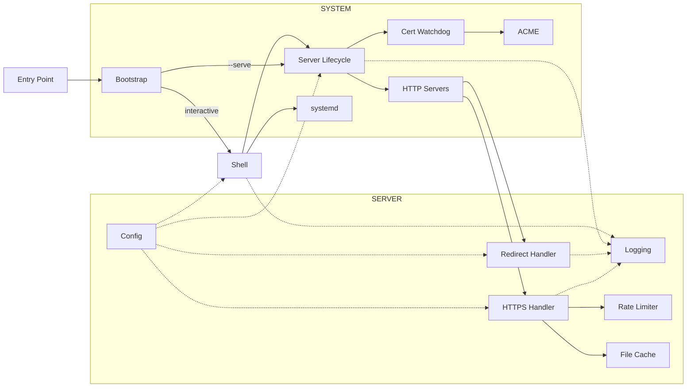

# Architecture

How `servette.py` is built — the current state of the system, for anyone who wants to understand or modify it. For *why* (scope, non-goals, methodology) see [`principles.md`](principles.md); to deploy and operate it see [`tutorial.md`](tutorial.md); the new-user introduction is [`README.md`](../README.md). This is the design philosophy made into a system: every piece below exists to serve a principle.

## How it works

Servette is a single file (`servette.py`, ~2,400 lines) with three sections, each readable on its own. Settings persist to `servette.toml` beside it.

| Section | Lines | Responsibility |
| - | - | - |
| **Server** | ~730 | every incoming request: config, rate limiting, file cache, the request handler and the HTTP servers |
| **System** | ~850 | the environment: bootstrap, server lifecycle, certificates (incl. the ACME client), systemd |
| **Shell** | ~800 | the interactive terminal interface |

### Server

**Config.** A `Config` object reads and writes `servette.toml`; every field has a default. `reload_if_changed()` runs on every incoming request, so edits take effect without a restart. Passwords are hashed with scrypt (memory-hard; N=2¹⁴, r=8, p=1) and never stored in plaintext; plaintext `password` fields in old configs are migrated on first load. The file is written `0o600`.

**Logging.** Interactive mode sends warnings and errors to the terminal; service mode sends output to the systemd journal (`journalctl -u servette`), which handles rotation and retention.

**Rate limiter.** Two independent in-memory sliding-window dicts per IP — total requests (default 120/min) and failed auth attempts (default 6/min) — under a `threading.Lock`. The auth limiter activates only when credentials are actually submitted, not on unauthenticated requests. IPv6-mapped IPv4 addresses are normalized. `X-Forwarded-For` is trusted only when a `trusted_proxy` IP is configured, and only its rightmost value (one hop). Stale-IP eviction runs in a background `_rate_sweep` thread every 30 seconds, off the request hot path; it starts and stops with the server, not at import.

**File cache.** Files are read once and cached in `_file_cache` keyed by path; compressible (text-like) types are also gzip-stored and the right encoding is sent per `Accept-Encoding`, while already-compressed types (images, fonts, video) are served raw. A file too large to fit the cache is served raw (uncompressed) without being stored, so it can't purge everything else and isn't re-compressed on every request. `mtime` is checked on each request, so the cache refreshes when a file changes — this is the live reload. ETags (SHA-256 of contents) drive 304 responses. Reading and compressing happen on the connection's own worker thread — each connection gets one — so a large file never starves other connections.

**Request handler (`_handle_request`).** The transport-agnostic core for every HTTPS request: rate limiting → auth → path resolution → file serving. It takes the method, path, and headers and returns `(status, headers, body)`, so it is a pure function the transport just feeds and sends — no socket, no framework. `_resolve_request_path()` resolves URLs within `serve_dir`, enforces path-traversal protection (403), and falls directories back to `index.html`. Serves a custom `404.html` if present, infers MIME types from extensions, honors single byte ranges (`206` / `416`) for media seeking, and sends security headers on every response: X-Frame-Options, X-Content-Type-Options, Referrer-Policy, Content-Security-Policy, Permissions-Policy, and HSTS when a domain cert is active.

**Redirect handler (`_RedirectHandler`).** The handler on port 80: serves ACME HTTP-01 challenge tokens from `ACME_WEBROOT` during issuance, preserves the query string, and 301-redirects everything else to HTTPS.

**HTTP servers.** `_handle_request` is wrapped by `_Handler` (a stdlib `BaseHTTPRequestHandler`) and run by `_TLSThreadingHTTPServer` — a `ThreadingHTTPServer` that terminates TLS from an `ssl.SSLContext` (minimum version, optional cipher list, ALPN pinned to HTTP/1.1) and performs the handshake on the connection's worker thread, not the accept loop, so one slow handshake can't stall new connections. A `BoundedSemaphore` caps concurrent connections (`MAX_CONNECTIONS`); past the cap connections are closed immediately rather than queued, and a per-connection socket timeout reaps slow or idle ones — together a slowloris / connection-exhaustion mitigation. The port-80 redirect uses the same server without TLS. Both run under `serve_forever()` in daemon threads, started by `start_server()`, which fails closed: the bind and the certificate load both happen synchronously as the server is constructed, so a port conflict or unreadable cert raises there and (under `--serve`) exits nonzero rather than leaving a process that looks healthy but serves nothing. `stop_server()` calls `shutdown()` on each server.

### System

**Bootstrap (`_bootstrap`).** Runs before any other code. If `sys.prefix` isn't the managed venv, it creates `.servette-env/`, installs its one dependency (`cryptography`), and `os.execv`s back into itself inside the venv. As a systemd service the venv Python is invoked directly and bootstrap is a no-op.

**Server lifecycle.** `start_server()` / `stop_server()` own the HTTP servers, their `serve_forever` daemon threads, and the background threads (rate sweep, cert watchdog). `_production_issues()` returns the conditions blocking production readiness — serve directory missing, cert not configured, self-signed cert, no password — and is printed on startup and on every `status`. This function *is* the claim ladder in code: it refuses to imply production-ready while anything is wrong.

**Certificates.** Self-signed certs come from the `cryptography` library (`_generate_self_signed_cert`). Let's Encrypt certs use Servette's own minimal ACME client (`_ACMEClient`) — RFC 8555 HTTP-01 over stdlib `urllib` with `cryptography` for the JWS signing and CSR — temporarily starting the redirect handler on port 80 if the main server isn't running. `_obtain_trusted_cert` first attempts a cert covering both `domain` and `www.domain`; if `www.` fails DNS validation only, it falls back to the bare domain and says so. Retries up to 3 times with backoff; skips the spinner when stdout isn't a TTY (auto-renewal). The client is deliberately narrow — HTTP-01 only, no revocation or key rollover — which is why it fits in one file instead of pulling in the certbot `acme`/`josepy` stack.

**Cert watchdog (`_cert_watchdog`).** A daemon thread polling every 60s: for a configured domain, renews when the cert expires in < 30 days (at most once per hour on failure); for self-signed certs, detects external file changes by mtime and reloads. `_wait_for_port_free()` gates restarts on the TCP port actually being free.

**systemd.** `enable`/`disable` write and manage `/etc/systemd/system/servette.service`. `cmd_install` creates the `servette` system user (no login shell, no home), chowns cert/key/config to it, and the unit runs as that user, sandboxed: `AmbientCapabilities=CAP_NET_BIND_SERVICE` lets it bind 80/443 without root, while `NoNewPrivileges`, `ProtectSystem=strict` (with `ReadWritePaths` limited to the server's own directory and the ACME webroot), `PrivateTmp`, and the kernel/cgroup protections confine it. `sudo` is needed only for the interactive shell, which writes the unit and calls `useradd`.

**Self-update (`cmd_update` / `cmd_restore`).** Updates come from signed GitHub Releases, not raw `main`. `cmd_update` fetches the latest release's `servette.py` and `servette.py.sig`, verifies the signature against the pinned `_SIGNING_PUBLIC_KEY`, validates syntax, and swaps the file in atomically; if the systemd service is active it then offers to restart it. Before swapping it copies the current file to `servette.py.bak` — a single-shot backup that `cmd_restore` rolls back to and consumes (one backup is ever kept). The signature is the trust anchor, and it is why distribution goes through releases at all: a release is verifiable, whereas `main` is whatever is currently there, signed by no one. Settings in `servette.toml` are never touched by an update. The release-publishing procedure (a maintainer task, since it needs the private key) is in [`AGENTS.md`](../AGENTS.md#releasing-maintainer-task).

### Shell

The interactive REPL shown when running without `--serve`. Dispatches to `cmd_setup`, `cmd_config`, `cmd_install`/`cmd_uninstall`, `cmd_start`/`cmd_stop`, `cmd_status`, `cmd_log`, `cmd_update`/`cmd_restore`. The `config` sub-shell writes each setting to `servette.toml` immediately. It contains only UI logic and is the only layer that writes to Config interactively.

### Key constants

| Name | Value | Purpose |
| - | - | - |
| `_VENV_DIR` | `<BASE_DIR>/.servette-env` | managed virtualenv |
| `SERVICE_PATH` | `/etc/systemd/system/servette.service` | systemd unit |
| `ACME_WEBROOT` | `/var/lib/letsencrypt/webroot` | ACME challenge file root |
| `RATE_WINDOW` | `60` seconds | sliding window for both rate limits |

### Notable design decisions

- **Stdlib `http.server` over an ASGI server** — a static site needs only HTTP/1.1, which every browser speaks; the threaded model (one capped worker thread per connection) is simple to reason about and removes the largest dependency. Servette owns its transport directly: TLS from `ssl.SSLContext`, the handshake off the accept loop, a per-connection timeout, and a connection cap — the hardening an ASGI server would otherwise supply, kept small enough to read in one file.
- **Managed virtualenv over system packages** — `.servette-env/` is isolated, reproducible, and invisible to the rest of the system.
- **CSP default blocks what static sites never need** — plugins (`object-src 'none'`), `eval()`, plain-HTTP external resources — while allowing own-origin, HTTPS externals, inline styles/scripts, and data URIs. Tune via `config > csp`; blank disables it.
- **Permissions-Policy default denies hardware APIs** — camera, microphone, USB, MIDI, serial — that need a backend or specialized hardware. APIs a static site might use (geolocation, fullscreen, payment) are left at browser defaults. Tune via `config > perms`; blank disables it.
